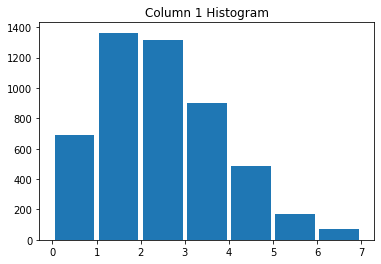
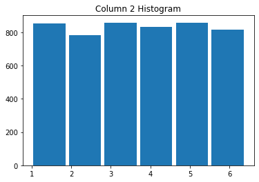
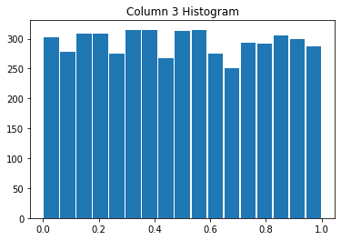
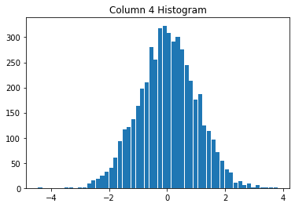
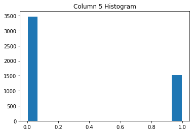

```python
import sys
import numpy as np
import pandas as pd
from numpy import genfromtxt
from tabulate import tabulate
import numpy.linalg as linalg
import matplotlib.pyplot as plt
from prettytable import PrettyTable


# Setting up print settings, for nicely formatted output.  
print_settings = np.get_printoptions()
np.set_printoptions(threshold=sys.maxsize)
pd.set_option('display.max_rows', 150)
pd.set_option('display.max_columns', 150)
pd.set_option('display.width', 110)

# Variables being used for printing output 
i = 0
matrixColumns = []
while i < 100:
    matrixColumns.append(" ")
    i += 1

```

# Homework 1 

## Details 
* Student: Segun Akinyemi 
* Due Date: September 11th, 2019

## 1. Linear Algebra in Numpy

1. Create a random 100-by-100 matrix M, using numpy method "np.random.randn(100, 100)", where each element is drawn from a random normal distribution.


```python
    M = np.random.randn(100, 100) 
    
    # Data Frame library for printing Matrices nicely 
    dataframe = pd.DataFrame(M, columns=matrixColumns, index=matrixColumns)
    print("   100x100 Matrix, with each element drawn from a random normal distribution\n")
    print(dataframe)
```

       100x100 Matrix, with each element drawn from a random normal distribution
    
                                                                                                           \
       2.086768  2.270628  2.777525 -0.124481 -0.233323 -0.276821  0.661550 -0.678903  1.282135  0.919274   
       0.408568 -0.013672  0.165651  0.599348  0.713868 -0.178690 -1.252261  0.263639 -0.974293 -1.361476   
      -0.788969 -0.727847 -1.937313 -0.520408  0.899910  1.788261 -0.219660  0.658537  0.327343  0.621748   
       0.358554  1.237381  0.404460  1.137368 -1.682077 -0.517867 -0.065082 -0.562977 -0.226136 -0.075371   
      -0.928239 -1.257305 -0.015606 -0.976063 -0.512705 -2.203960  0.122852 -1.642509 -1.031649  0.798635   
      -0.883585 -0.544505  0.381684  1.676142 -0.323097 -0.084726 -0.629439  1.165826 -1.289858 -1.536771   
       0.807079  0.801384  0.886887  0.173944  0.179833 -0.175677  0.176276 -0.658205  1.119806  0.108791   
       0.366170 -1.615150  0.809218  0.913215 -1.302464  0.496188  0.985112 -0.309622 -0.878494  0.598562   
       0.350462 -3.849464  1.029612  0.748215 -0.671417 -1.106611  1.855553  0.112333  0.449039  0.225548   
      -1.645021  1.143075 -0.372052 -0.152411 -0.031253 -0.164285  1.875451 -0.461417 -0.294842 -0.310691   
       0.075710  1.055028  0.585759  1.000681  0.359568 -0.147228  0.094509 -0.683264  0.167377 -1.746833   
      -0.920464 -0.615596 -1.279512  0.364133  2.054820 -0.455970 -0.259115  0.738898 -0.196282 -0.639660   
       2.956158 -1.416328  1.655439  0.753284 -0.303947 -0.458712 -1.564590 -0.981919  1.791261 -0.249432   
      -0.515765  1.947272 -0.543092 -1.761005  0.618902 -0.458760 -0.816139 -2.076329 -0.458625  0.740942   
      -0.292619 -0.365585 -0.526866  0.980441  0.851924  0.513391 -2.298270 -1.901066 -1.574066  1.610671   
      -1.216912 -1.066828 -0.333477  1.471596  0.503051 -2.171627 -2.103012  0.908001 -0.044621 -0.152247   
      -0.674255 -0.065108  1.406092 -0.235580  0.791452 -0.938560  1.637659  0.974554  0.691521  0.499698   
      -0.402117 -0.068757  0.309312 -0.479259  0.059546 -1.129417  1.051615 -0.535216  0.069171 -0.728859   
      -0.817918  1.352454 -1.011248 -1.464670 -0.257285 -0.192422  0.929474 -1.462946  1.024872 -0.089374   
       1.041674  0.107374  0.948447  1.037774  1.587956  1.641075 -0.835054  0.315807  0.404608  0.659069   
      -1.122657 -1.225250 -2.339721  1.350504 -0.284800  0.190076  0.298508  0.225825 -0.691683  1.460812   
      -0.239139  1.330476 -1.239101 -0.363184 -0.408157  0.018696 -0.462774 -0.341520 -0.057573  0.233677   
       1.293615  1.032172  1.053026 -0.718041 -0.042210 -0.148924  2.408630 -0.924962 -1.616787  0.089632   
       0.180695  0.897983 -0.757848  3.671286 -1.083765 -0.662705 -0.372865  1.969695  0.646277  0.382129   
       1.423732 -1.025459  0.451842  0.348510 -0.236902  1.506916 -1.320921  1.329407 -0.365265 -0.229161   
       0.420524  0.667304 -0.333254 -0.965247  1.857475  0.354961  1.445680  0.477407  0.956073  1.066161   
      -0.448414 -0.684465  0.866679  0.019412  0.267189 -1.284610 -0.218875 -0.346134  0.382857 -0.764924   
      -1.078374 -1.025747 -0.183118  0.065345  0.916678  0.638712  1.747082  0.219350 -1.033434  0.986858   
       0.107796  1.111816 -0.710480 -0.727510 -0.093357  0.422463 -0.837186  0.106989 -0.113802  0.947813   
       0.327711  0.996767  0.864859 -0.089366  0.091126  0.932158  1.673660 -0.093964  1.189565 -1.423808   
      -1.135764 -1.946448  0.675357 -0.894188 -0.530171 -1.881940 -0.171458 -1.713837  0.285594 -0.981322   
      -1.134016 -1.653638 -0.685657 -1.121838 -1.646910  0.868015 -0.432390  0.444246  0.412023  0.131348   
       0.249183 -0.905176 -0.976371 -0.603718  0.784192 -2.819793 -0.309612 -0.883741  0.363680  0.974994   
       1.766801  0.390576 -1.007123  0.224910 -0.293807  0.145324 -0.969424 -1.198942 -0.819509 -0.110719   
      -0.697167 -0.429715  0.031578 -0.932083 -0.973726 -1.567447  1.103035  0.744671 -0.346142 -0.398813   
      -0.797833 -0.977111  0.266866  1.539876  0.515092  1.384947 -0.712536 -0.705699 -1.595607  0.617913   
      -0.921687  1.584682  0.867142 -0.073857 -1.354103 -1.285746  0.012122  1.128031  1.496112  0.784300   
       0.901292 -0.748284  0.585210  2.008188 -0.353385  0.606274 -0.787679 -0.457290 -0.596145 -1.270756   
      -0.833394  0.142290  0.643700  1.922778 -1.746276  0.555051  0.127661  1.249814 -0.161208  0.546671   
      -0.029810 -1.377937 -0.790498 -0.150858  0.572020  0.075977  0.508873  0.357217 -2.261688  2.165581   
       0.530879 -1.215616  0.822975  0.717881  0.647536  1.100768  1.927479  1.374160 -0.123712  1.071111   
       1.081437 -0.115634 -1.519125  0.944599 -0.365879 -0.496983  0.356861 -1.172479 -0.201366  0.972066   
       0.598786 -0.592098  1.657236 -0.438879 -0.264964  1.072214  0.649976  0.101495  0.027396  0.092364   
      -0.607445  0.439577  2.316277  0.549248  0.990674  0.563384 -0.794289  1.002629 -0.144202 -0.407789   
      -0.377709  3.082707 -1.139968 -0.199571  0.339659  0.374973  1.243489  0.210372  0.261731  1.973588   
      -0.318073 -1.485195 -2.443161 -0.770361  1.063409  0.111620  0.802635  0.910529  0.298678 -0.021321   
       0.356563 -0.188887 -0.436053  1.325448  0.783495  0.933017  1.629688  0.734630 -0.361222 -0.475106   
      -0.902737  0.439732 -0.653458  1.385388  1.330198  0.333812  0.601153  0.670048 -1.686378 -0.685062   
       0.041808  1.076448 -0.247886  0.313421  1.749679  0.024625  0.395007 -1.359005  1.055273 -0.253042   
      -0.354471 -1.322716  0.254296 -0.427110 -3.902945 -0.048174 -0.573918 -0.623494 -2.406260  1.126886   
       0.852657  1.671106 -0.475758 -1.192436  0.348880  1.692275  0.302385 -0.726606 -0.295694 -1.307895   
      -0.605367 -0.023729 -0.116235  0.101341 -0.384200 -0.901702 -0.839988  0.167445  1.149144 -0.157739   
      -2.052687 -0.949653 -0.489609  0.520561  2.061813 -1.253450 -0.990107  0.528352  0.675360 -0.325499   
      -1.795850  0.563554  1.662038  0.624463 -2.197169 -1.040137  0.998361  1.018710 -1.047085  2.023220   
       1.066051  0.119107  0.191610 -0.930334  0.678919  1.107386  0.010796 -1.511064  0.105451 -0.950066   
       1.404825 -0.335089  0.941759 -0.412779  0.502250 -1.337269  1.673389 -0.080477 -0.731516  0.556379   
      -0.732168  0.445271  1.050836 -0.809325  0.577314 -0.228684 -0.063541  0.618927 -1.049396  0.289151   
      -0.155426  1.168388  0.745238  1.366529 -0.485692 -1.313783  0.655645 -0.696610 -0.481992 -0.996463   
       0.880618  0.525535 -0.818509  1.383106 -1.012608  2.483318  0.623730 -0.924495  1.860012 -0.399407   
      -0.031845  0.046235 -2.302496 -1.746221  0.300414  0.163821 -0.577149 -0.336647  0.167815 -1.060068   
       0.401054 -0.055644 -0.412663 -0.981700 -0.548661  1.710232 -0.183886  1.038097 -0.768749  0.168761   
      -2.040908  1.958392  0.231132  0.272521  0.311879  0.083678  0.149760 -0.056860  0.629300 -0.318355   
       0.982172  1.857240 -0.048252  0.369531 -1.918369 -0.780079 -1.383687 -0.439154 -2.339110  1.477638   
      -1.626526 -0.364054 -1.503079 -0.515013  1.030272  0.579827 -1.161514 -1.160390  0.458261 -0.306197   
       0.291221  0.221636  1.417269 -0.394545  0.625458 -1.460333  0.437234  0.148339  0.652913  0.859818   
       0.314559  0.865755  0.510332 -0.105314 -0.608310 -1.721287  0.567267 -2.412810 -0.667502  0.885801   
       0.999405 -1.122726 -1.790591 -0.880098 -0.211399 -0.000678  1.162195 -1.903806  0.222702  0.927904   
       1.138371  0.357700  0.365027 -0.340353  0.295431  0.595230  1.126715  1.249609  1.904955  0.320931   
      -0.422967 -0.890825  1.687877 -0.092276 -1.445888  0.968362  0.810250  0.466482 -0.289634  0.862938   
      -0.425720  0.302210  0.016928 -0.076330 -0.397775 -1.822088  0.050122 -1.983797 -0.684453  2.475387   
      -0.511263  0.591167  1.438878 -0.339235  2.936560  1.331001 -1.123515  0.337843 -2.054465  0.397160   
      -0.891452  0.741027  0.012463 -1.428912 -0.737673  0.865754  0.319054  1.133268  1.246268 -0.194185   
      -0.485122 -0.454396 -0.101879 -0.093529  0.025188  1.642950 -0.113801  0.668949  0.504397  0.725168   
      -0.614184 -0.049564 -2.154958 -0.898070 -1.351921 -1.547395  2.703145  0.179726  1.231053  0.445139   
       0.248413  1.489533  0.117385 -1.119061  0.929077  0.439085 -0.189189  0.509356 -0.141256 -1.937144   
      -0.547558  0.876208  1.595836  1.136519  0.463832  0.751374  0.511100  0.728131  1.082433 -0.465222   
      -0.248039 -0.324278  0.086011  1.110117  0.758598  0.357613 -0.340245 -0.337070  0.738209  1.078456   
       0.682492  1.582405  0.264191  0.741382 -0.081762  1.479348  0.635927  0.519787  0.827767  1.174195   
      -0.826164 -0.393268 -0.090829  0.601963 -0.367174 -0.358829  2.126758  0.026098  0.522903  0.810985   
       0.501428 -0.576307  0.087497  0.608913  0.855646 -0.496085 -1.133624 -0.785315 -1.251098 -0.693392   
       2.139252  1.283439  1.115318  1.020724  0.460936 -0.362039 -0.341423  1.026698 -0.490649  0.346453   
       1.299393 -1.912029 -0.481367 -0.291405 -0.543875 -0.071075 -0.699724  0.507057  0.031849 -0.937370   
       1.222561 -0.780935  0.536285  0.043947  0.398085  1.929742 -0.213604 -0.358398 -0.117436  1.425233   
      -0.511832  1.718707  1.856603  0.751749 -0.043190  2.723598  1.511950  0.605510  0.659375  0.039054   
       1.346244 -0.069453 -1.762523  0.173506 -1.005271  0.416271  0.366674 -0.039224 -1.575652 -1.287699   
       2.178097 -0.994076  0.089461 -0.560749 -0.402060 -1.901527  0.053774  0.908658  0.177399 -0.616575   
      -2.571001  0.654975 -0.599738  0.267100 -1.101194  0.936041  0.438204  1.162828 -0.334048 -0.106955   
      -1.575691 -0.119175 -0.686148  1.517955  0.389168  1.884142 -0.094872 -0.639546 -1.576125 -0.373770   
      -0.064785  1.005319  0.098108 -0.551952  0.602999  1.067112 -1.829540  0.692123  0.306417 -2.182478   
       0.243110  0.314065 -0.805851  1.687955 -0.478391 -0.725726 -0.556271 -0.156414  0.309440  0.557777   
      -0.384491  0.112810  0.262298  0.376691  0.359653  0.549988 -0.603075 -0.293007  0.630722 -0.288308   
       0.159475  1.524046 -1.865543  0.256781  1.902789 -0.607191 -1.752154 -1.056027  0.821073  0.468380   
      -0.353801 -0.590110 -0.772983  2.389163  1.242056 -0.112518 -0.393503 -0.962468 -0.528560 -0.278456   
      -0.605008  0.088362 -0.658729  0.268431  0.179784  1.294449 -0.433097  0.374841  0.337658 -0.462278   
      -0.172772 -0.257516  0.751581 -0.072308  0.127220 -0.684736 -0.850029 -1.453344  0.373617  0.749340   
       0.361069 -0.223420  0.449454 -0.346806 -0.897173  1.574612 -0.306790 -1.408599 -0.074571 -0.527672   
      -0.227198 -0.060435  0.400761 -0.646643 -1.029556  0.127577 -0.359651 -0.689204  1.910554  0.863162   
       0.429598 -0.006815  0.433170  0.190676 -1.102424  1.216629 -0.420594 -0.007195  0.382101  0.833843   
       0.713015 -0.553321  0.924972 -0.488408 -0.547061 -0.307441  0.138484 -0.918087  0.394538  1.464416   
      -1.098090  2.392403  0.232580  0.808618 -1.141835 -0.323242  1.599678 -0.314967  0.365199  0.529992   
    
                                                                                                           \
      -0.902116  0.312428 -0.874966 -0.707321 -0.803485  0.306324 -0.737970  0.625357 -0.199328  0.916227   
       0.426978  0.193758  0.634880 -0.886792 -0.842110 -0.697045  0.024985  0.054441 -0.314559  0.633019   
       0.240512  0.204010  2.074263 -0.312119 -0.392952  0.329790 -1.155341  0.377182 -0.061315 -0.338850   
       0.628750 -0.227185 -0.390155  1.706960  0.327735 -0.399492 -0.793514  0.880269  1.653726 -2.068504   
      -1.887219 -0.786173 -0.263984  1.158871 -0.581500  0.351386  0.266074 -1.353763  2.177041  1.749285   
       0.527549 -1.351595  0.303480 -0.001844 -0.549482  0.982828  0.867292  0.066705  1.255081 -0.966340   
      -0.588630  0.832131  1.546996  0.893138  1.505567  0.904338  1.446051 -0.374965  2.201622  0.866799   
      -0.099364 -1.203771 -0.607980 -1.329539  0.062759  1.028139 -0.010691  0.722860 -0.925384  1.415128   
      -0.778743 -0.639840 -0.201065 -0.295836  0.178081  0.781312 -0.380307  0.430235 -0.301365 -1.072148   
      -1.239247 -0.223645  1.100091 -0.912161  2.099395 -1.875432 -0.943778  0.746699 -0.626068 -0.242641   
       1.106321 -0.900122 -0.307119 -2.246532 -0.341865  0.949033 -0.977422  0.379013  1.329880 -0.031224   
      -1.118448 -1.405147  0.438005 -0.020480  1.537736  0.236673  1.585552  2.282895  0.465733 -1.551053   
       1.292702 -0.232384 -1.261959 -0.901232 -1.274445  1.440497  0.318147  0.388972  0.550068  0.401015   
       1.730387  1.433056  0.069761 -1.286038 -0.465859 -1.473421  1.250386  1.962237  1.352470  0.167711   
      -1.177659  0.258888  0.637430  1.509167  0.772820  0.258637  0.675266 -1.138405 -0.082901 -0.945323   
      -0.915663 -2.147922 -0.005542  1.139104  0.484617  1.070031  0.423905  0.946444  0.053089 -0.495463   
       1.074224  0.116884  0.479823 -0.077049  0.149877 -0.571806  0.361924  0.452181 -1.244631  0.503958   
      -0.087859 -1.151856 -0.133713 -1.304188 -0.666431  1.460770 -1.445653 -0.014245 -1.239106  2.347889   
       0.207593 -1.546873 -0.369606 -0.156799  0.789605  0.960446  0.537815  0.274737 -0.686416  1.090905   
       0.262776 -1.953531 -0.991741  0.727281 -0.250366  0.308736  1.010282  0.977113 -0.720550 -0.466711   
      -0.627894  0.279264  1.892195  1.989713 -0.233873  0.134045  0.070103  1.245401 -1.130479  1.525814   
       1.461309  1.351091  0.045299 -0.369809 -0.608917  1.005033  0.342544 -0.031359  0.267222  1.877053   
       0.627594 -1.611324 -0.589322 -1.515159 -1.696558 -1.026436  0.563517  0.507939  0.262012  1.931882   
       0.377146  1.887524 -0.185904  2.208104  1.371354 -2.201959 -0.748035  1.803991  0.097714  0.400685   
       0.827277 -1.916144  1.229327 -1.274059 -0.045943 -0.858490  0.485112 -0.281065  0.285629  0.736240   
       1.190035  1.168204  0.593582 -0.364745  0.008240 -0.179512  1.009304  0.874099  0.419150  1.734690   
       1.894773 -1.402826  0.584729 -0.043627 -1.081221  0.127576 -0.672715  0.866119 -1.413535  2.442541   
       0.688955 -1.347614  2.150721  0.149132 -0.771223  1.830429 -0.559959 -2.268751 -0.589497 -0.408219   
       1.712722  0.388897  0.126010  0.478560  1.840680  1.831513  0.656515  1.153492 -0.695734 -0.909672   
       0.344838  0.207525  0.822087 -0.199658  0.087324  0.285795  0.688989 -1.874478 -1.049969 -0.298357   
      -0.112498 -1.562913  0.110383  0.834966 -0.892335 -0.809163  0.455688  0.170320 -1.362356  0.958996   
       0.793543 -0.670640 -1.283752  0.676482  2.231740 -0.133194  0.492344 -0.060978  0.443467 -1.038147   
       0.787440  0.394412 -0.403465  2.159460 -0.497597 -0.304291  0.175948 -0.000160 -0.422399  0.405500   
       0.645680 -0.739201 -0.339669  0.817069  1.467394  0.833194  1.201950  1.624784  0.684769 -0.214539   
      -0.215179 -0.339187  0.049376  1.339737 -0.872767 -1.398296  0.340133  0.400144  0.599120 -0.216311   
       0.401073  0.576457  0.433977  0.894839  1.090876  0.553619 -0.424592 -2.188463 -2.165004  1.110690   
       0.683911 -1.386460  1.149545  0.253852 -0.649417 -1.872697 -1.804177 -2.222598 -0.366993  0.380618   
      -0.507481 -0.393007  0.424496 -1.108659  1.396342  0.126030 -0.123388 -1.084780  0.333796  0.372036   
      -0.427165  0.323917 -0.780275 -0.870082  1.995132  0.899260  0.724659 -0.844172  1.124331  0.294371   
      -0.266706  1.555163  0.973877  0.954797  0.600970 -0.940511  1.068023  0.438421  1.378025  0.559111   
       0.837560  1.193271 -0.190006 -0.268023  0.778126 -0.821638 -0.101984 -0.050804 -0.518747 -0.100043   
       1.451808 -0.336440  1.378641  0.712478  1.296837  1.201634  0.182968  1.973518 -0.112352 -0.948152   
       0.077811  0.687989 -1.020927 -1.143219  0.434699  0.647808  0.097050 -0.390360  0.245286 -1.075041   
       0.161984 -0.753111  0.736856  0.865086  0.979696 -0.288167  0.074566 -1.039620  1.249078  0.707355   
       0.298061  1.331840  1.178663  0.330006  0.905792 -0.490486  1.330776 -0.783378 -0.567374 -0.286764   
      -1.187753 -1.068697  0.405756  0.269462 -1.077063  0.556174  1.060422  0.267484 -0.198301  0.629801   
      -1.875754  0.472036  0.824007  0.935910  1.589077  1.342588  0.391410 -1.547290 -0.912167  0.055011   
      -1.159020 -0.846104 -0.035531 -0.016370 -1.954931  0.429943 -0.259473 -0.611526 -0.818540  0.852394   
      -0.964592 -0.084299 -0.861331  0.614974 -0.041065 -0.309738 -1.460490  0.712818 -0.371784  1.199667   
      -0.671957  1.005889 -0.218730  1.610618  0.548218 -1.183485 -0.358826  0.469729 -0.301353 -0.525866   
      -0.084143  0.591140 -1.140759  1.457286 -0.850757  0.529912  1.440097  0.282612  1.507142  0.795666   
      -1.368274  0.630521  0.402859  1.662849  0.389390 -0.349582  1.670790 -1.183330  0.275399  1.499448   
       0.486342 -0.439635  1.320488 -0.797824  0.566528 -0.640102 -0.584826 -0.771915 -0.011628 -0.002450   
      -0.435350 -0.218064  0.916445  0.634699  1.404192  1.575072 -1.055323  1.104134  0.880231 -0.096961   
       0.146281  0.890392 -0.927656  0.589652  0.979160  0.397031 -0.179706 -1.875023  2.457852 -1.320079   
       0.713466 -0.882850  0.594191  0.560230 -0.024424  0.891300 -1.333335  0.445556 -0.461989  0.369617   
      -0.868010  1.444028  0.088667  0.174648 -0.085049 -0.166442  0.338122 -1.252519  0.586444  0.652410   
      -1.022661 -0.812390 -0.660708  1.928243 -0.271069 -0.387094  1.019692 -0.850275  0.168368 -0.145250   
       0.132005 -0.042427 -0.289339 -0.870959  0.567853  0.631730  0.010575  0.819085 -0.576014  0.408397   
       1.298727 -0.408584  0.498909 -1.607518 -0.491995  0.881192  0.441511  0.957001  1.001107 -0.342090   
      -1.312336 -0.620943 -0.915474  0.607972  0.170085 -1.901619  2.053184 -0.494568  1.082490  0.839795   
       0.186843 -0.707171 -1.089984  0.695608  0.059214 -0.118831 -1.164378 -0.271525 -0.639262  1.283162   
      -1.776763  0.872972  0.787179  0.213229 -0.148298  0.499556  0.262108 -0.256474  0.329334 -0.129782   
       1.435637  0.353103  0.703474 -0.200157  1.250978 -1.494686 -1.377452 -2.232272 -2.052541  0.428712   
      -0.215638 -0.491604  0.586148 -1.247270 -1.040204 -1.489176 -0.100872  0.637847  0.567960  1.310409   
      -1.192557 -1.242970  0.026810 -0.193403  1.191744 -1.952094  0.722843 -1.068490 -1.425552  0.944242   
      -1.353526 -1.115068 -0.714206 -0.007514 -0.240773  0.722951 -0.434793 -1.103652 -1.029500  3.144562   
      -0.236135 -0.677388  0.580952 -0.483120  0.060443 -1.278933 -0.077499 -0.609019  0.396064  1.219269   
       0.867694 -0.467360 -0.320384 -0.932220  0.131610 -1.629877 -0.073390  0.475249  0.032663  0.294871   
       1.122431  0.385990  1.432410 -0.526096 -0.620637 -0.722926 -0.056131  0.870570 -0.612812 -0.629466   
      -0.359254  2.973717 -0.090146 -1.016713 -0.048630  0.433233  0.417510  0.086408  0.165323  0.900351   
       1.351926 -0.034996  0.478389 -2.706822 -0.180010  0.875465 -0.749616  1.393131  0.789650 -2.284595   
       0.780628 -0.778397  1.297579 -0.004546 -1.149843  0.949272 -1.404418  1.227107  0.895572  1.665061   
      -0.661462 -0.095581 -1.132815  1.568738 -0.257548  0.707882  0.590952 -0.170437  0.696296  2.474763   
      -2.421333  2.573299  0.031220  1.249063  1.690132 -0.295463  0.165231  0.790688  1.007212  0.303510   
       0.805026 -0.301274  1.512475 -0.935659 -0.203939 -0.481495  0.608607  1.901377  0.691408 -0.549664   
       0.074943  0.739526  0.037890 -0.193521  0.230219  0.145024 -0.735750 -0.953918  0.925152  0.960010   
      -1.003843 -0.523653  0.351992  0.216574  1.584877 -1.596439 -1.158036  0.929292 -1.103007  0.952429   
       1.663970  0.531553 -0.568116  0.557428 -2.193846  0.380329 -1.160834 -0.858668  0.983035  1.956499   
       0.736976 -0.237641 -0.227542  0.656633 -0.566921 -0.424411  0.137366 -0.927721  0.659268  1.614011   
      -0.416938  1.332989 -0.634901 -0.210974  0.245863  0.034864 -1.463623 -1.212814  1.261715 -1.717162   
      -0.379989  0.945046 -0.837964  0.221222  0.303697 -0.286164  2.568936  0.148846 -0.250429 -0.791720   
       0.764700 -1.455946  1.014109 -0.203367  0.271720 -1.608216  0.206293 -1.073302 -0.504689  1.021211   
      -1.296921  1.669691  0.167015  0.391198 -0.007839  1.215967 -0.228739  0.608662 -2.815319 -0.269973   
       1.054288  0.030676 -1.222154 -0.426890 -1.476166  0.358095 -1.041311 -0.368011 -1.118240 -1.650687   
      -1.064735  0.353166 -1.544775  1.123194 -0.051145 -0.788527  0.856530 -0.761978  1.027714 -0.439697   
      -1.449503  0.832802  1.098032 -1.048324 -0.106900 -0.545264 -0.951097 -2.583206 -1.892866 -0.253284   
       1.083772 -1.397345 -0.419044  1.460097 -0.511418 -0.111557  0.535045  0.603360  1.206934  0.372890   
       0.402720 -0.163150 -0.781179  1.097449 -0.961660  0.013792  1.157085  0.695819  0.305647 -0.164487   
       0.284379 -0.492079 -1.114772  0.938723 -0.607279 -0.818023  0.261599 -0.907486  0.608069  0.509143   
       0.530682  1.429903  0.413150  0.096506 -0.641777  0.133644  0.973647 -1.561933  0.109596 -0.683760   
      -0.849457  1.587950  0.465247 -0.357015 -0.189432  0.912884  0.503311 -0.655292  0.236685  0.402071   
      -0.075046  0.881555  0.787266 -1.266800 -0.625432  0.385435 -0.984970  1.603515 -1.118872  1.975549   
       0.307483 -0.642319 -0.559840  0.501937  1.373769 -0.173569  0.995259 -1.278127 -0.203473  0.511419   
       0.347132  0.860025 -0.347193 -0.229376  0.504729  0.731910  0.313596 -0.021141  1.807672  1.539364   
      -1.086984 -2.384603 -0.237419  0.327469  1.323212  1.892085  0.761116 -0.272789 -1.271033 -0.327868   
       1.846154 -0.204487 -0.041238 -2.174811 -0.354951  0.255570  0.675764  0.251679  0.414208 -0.820119   
       0.892305  0.153734 -0.236497 -1.729930  1.179991 -0.050011  0.585082  0.281953 -0.604746 -2.198611   
       0.915511  1.255092 -0.686662 -1.130751  0.761553 -0.184990  0.448030 -0.829659 -0.357047  0.983388   
       0.269813 -2.559971  0.969345  0.229025  0.880089  0.601288 -0.014919  1.062120 -1.489954 -0.224654   
    
                                                                                                           \
      -1.653284  0.800396 -0.438378 -0.416466 -0.521008  0.052509  0.705288  0.488595 -0.401074 -0.265490   
       0.239187  0.347298  1.563674 -1.004314 -0.259625  0.341473  0.324541 -1.092346  0.575297  1.481431   
       1.409606 -0.975236 -0.906751 -0.665312  0.034609 -0.160840 -1.218776 -3.325839 -0.279908 -0.270590   
       1.081725 -2.335498  0.259629  0.498651  1.320827  0.018900 -0.711423  1.301323 -3.510932  1.342065   
      -0.618809 -0.352581 -0.853944  1.193282 -0.076197 -1.344880  0.069523  0.618694  0.141825  0.914122   
      -1.313519 -1.415631  0.310173 -0.421710  0.599302  0.103554  1.015284  0.346347 -1.729959 -1.275325   
      -1.086376 -0.995503 -1.515128  0.711304 -1.577725 -0.003167 -1.837043 -0.085937 -1.015014 -0.140078   
      -0.048628  0.044305 -0.161271  2.221384  0.250793 -0.352274  0.215731 -0.598570 -0.689592 -1.559917   
      -1.699246 -1.015224 -0.539135  0.288410  0.261206  1.733864  1.706471 -0.972476 -1.667488  0.092814   
       1.026961  2.005952  0.546015 -0.620220  1.292557 -0.989226 -0.749717 -0.984280  1.130091  0.309802   
      -0.775491 -0.689414  0.842170  0.112782  0.343194 -1.308002 -1.528121  0.731802 -0.780370  0.646825   
       0.837245  0.760612 -1.314556  0.081229 -1.272025  1.743234  0.015068  1.497983 -0.395734 -0.354518   
      -0.955222 -0.164643 -0.348329  0.373827  0.754067 -1.122753 -0.690046 -1.278446 -1.793964  0.233627   
      -1.475717  1.226653 -1.193672  0.706372 -0.643146 -0.511044 -0.323340  0.557051 -0.345879 -1.205988   
       0.647849  0.294546  1.941426 -1.388684 -1.146167  0.653032  0.121496  0.836576  0.763016  0.546582   
       0.298580 -0.060869  0.432747 -0.175335 -0.287785  1.166916 -0.573342 -1.570231  0.494118 -0.422826   
       2.237106 -1.245894 -2.205683 -0.094429 -1.340590  0.775365  0.513065 -0.977293  0.838557 -0.966856   
      -0.498408  1.076499 -1.399830 -0.067315  1.663505 -0.673432 -0.262468  0.760411  0.083060  0.161929   
       0.640614  1.439945 -0.716816  0.860944 -0.394837  0.522548  0.596715  0.349835 -0.232052 -0.171829   
       0.063082 -1.640733  0.190518  0.624565  0.754223 -2.006348  0.465066  0.663465 -0.167990 -0.984078   
       0.472362  1.259288 -0.401709 -0.612436 -0.087854 -0.189934 -1.574459  0.148992  0.792180  0.411398   
      -0.489005  1.263732 -0.639050 -1.114179  0.574801 -1.233990 -1.778573  1.827494 -1.465948  0.096316   
      -0.441158 -0.040525 -0.091097  0.721841 -0.558127 -1.322356  1.084988 -1.581040  1.232623  1.080580   
       1.984696 -1.335573 -0.917191  0.039804 -1.228158  0.083729  0.204024  0.075874  0.679287 -0.077200   
       0.290861  0.480432  0.611442 -0.471522 -1.422268 -1.471090 -2.208887 -1.252835 -1.083057  0.284163   
      -0.114508  1.125225 -2.008919  1.382016  1.189296  0.745714  1.879220  0.165464 -1.088013  1.532588   
       0.818953  0.525109 -2.093179  2.308720  0.433396 -1.323710  0.368072 -1.483453 -0.382112 -0.969455   
      -0.592779  0.545103  2.272595 -0.409289 -1.488362 -0.695258 -1.414764  0.017760  0.575594  2.028239   
      -0.606781  2.180227 -0.713290 -1.383236  0.345460 -0.935000  0.243863  2.497335  1.032154  4.276488   
      -0.383102  1.537457  0.609532 -0.567910  1.564261 -0.569208  1.285576 -0.427125  0.572831 -0.901086   
      -1.858508  0.617529 -1.545234 -1.027969  0.770978  0.226238  0.312213  1.012793 -0.100637 -0.332876   
      -0.865306 -0.758071  0.029062 -0.911805  0.716012  0.931362 -0.874204 -0.967790  0.397425  0.930285   
      -0.550445 -0.276525 -0.739676  1.066469 -0.106119 -0.606321 -0.521093  0.336458 -0.460167  2.697875   
      -1.426985  0.163486  0.166066  1.500880  1.347451 -1.120864  0.141805 -0.139209 -0.316167 -0.226015   
      -1.207443  1.844286 -3.276223 -1.260690 -1.121403  1.746996  0.279104 -0.466813 -0.533112  1.354184   
      -1.050960 -0.023758 -0.165636  0.593568  0.275646  1.109675 -0.359834 -0.340661  0.232973  0.744781   
       0.714247  0.567752 -0.445881 -1.341677  0.233079  1.689589  1.364592 -0.009461 -1.445077  0.063846   
      -0.647580 -0.929136 -0.350085  1.051327 -0.849001  1.636585 -1.131835  0.180367  1.480516 -0.787505   
      -0.550348  1.277049  1.038951 -0.721463 -0.568415  1.486549 -0.804455  0.458832  0.431834 -0.426903   
      -0.959521 -1.276702  0.570492 -0.151600 -1.322445 -0.041593 -0.391684 -0.618090  0.869847 -1.337910   
      -0.277748 -0.165871  1.392423  0.935400 -0.616283 -1.596935  1.503162 -0.097402  2.072283  2.543617   
      -0.625064  1.131107 -1.336166 -2.514439  0.291645 -0.691878  2.591048 -0.964713  0.292917 -0.239958   
      -2.334665 -0.554456 -0.956453  1.590574  0.780663 -1.588641 -2.241755 -0.410454  0.111931  0.878762   
      -0.886073  0.344593 -1.361138  0.652060 -0.138403  0.151749  0.117505  0.841655  0.933737  0.920273   
      -0.637562 -0.974938 -1.035314 -0.436852  1.800242  1.571855  0.489981  0.852642  0.712913  1.821489   
       0.468730  0.452500  0.399776  0.285317  0.841854  0.247069  0.392782 -2.111414 -0.256728  1.256109   
       0.267707 -0.536162  1.359879 -0.518230 -0.364936 -1.529047  0.476777  0.075065 -2.306361 -0.243450   
       0.197413  1.537961 -0.113218  0.107363 -0.193951 -0.578059  0.838674 -0.235009  0.336976 -0.151173   
      -0.054685 -0.632539 -0.765982 -1.574695  0.532478 -0.068980  1.142203 -2.461226  0.514719 -1.050516   
      -0.604462 -0.420449 -0.622470 -0.138618  1.412374 -0.714116  0.319220 -0.859774  1.644772 -1.569572   
      -1.124358 -0.094207 -0.785596 -1.314619  1.150585 -0.335318 -1.141698  0.478749  1.341440 -0.752293   
      -0.097380  0.725858 -0.175362 -0.280814  0.926700  0.541513  0.881962 -1.169076 -0.500234  1.460085   
       1.609941  1.238895 -1.859138 -1.626144  0.027161 -1.574824  1.788767 -0.882161 -0.016596  0.122002   
      -1.242420 -0.760227  1.059485 -0.135315 -1.109986 -0.369278 -1.446579  1.191934 -0.076211  0.953401   
       0.676467 -1.217342  0.139291 -0.415332 -0.083167  0.249956  0.265138  1.275251 -0.743677  1.388948   
       0.902195 -0.879197  0.525949  0.329441 -0.713780  1.570885 -1.196540 -1.260356 -0.476054 -0.287225   
       1.134028  0.129590 -0.099901 -0.615419 -0.778704  1.389428 -0.102394 -1.139532  0.029557  0.168616   
       0.078713 -0.922767 -0.193022 -0.363374  0.454018  1.056523 -0.482716 -0.518670  2.402917 -0.051024   
       0.258362 -0.345729 -0.433456  2.060409 -0.915943  0.011336  0.281488  0.877246 -1.510003  0.389115   
       1.210311  1.415556 -0.104534 -0.934163 -1.247456 -0.585471 -1.083343 -0.110321 -0.319316 -0.148385   
      -0.244407  2.997854 -0.806595  0.020519 -0.936649  0.307781 -1.264700  0.417734  0.331172 -0.304541   
       1.533020  0.543541 -0.654164  1.498963 -0.917697  1.263487 -0.998157  0.843090 -0.602945 -0.693753   
      -0.579660 -0.937252 -1.868705  0.208953  1.141263 -0.020547 -2.779304 -0.333357 -0.080626  0.025094   
      -0.171519  0.633057  0.096483 -0.125643  0.603180  1.748779 -0.895464 -0.418077  1.204096  1.014419   
      -1.062187 -1.493622 -0.356950 -0.007471  0.366747 -0.178778  1.134331  2.876508  0.516675 -1.956269   
      -0.551033 -0.084390 -1.143592 -0.910706 -0.734488 -0.313173 -0.542111  2.287442  0.178395  0.733598   
      -1.739183 -2.544562 -0.997844 -1.604520 -1.078420 -0.534221  2.329376 -0.082892  1.187797 -1.738979   
       2.131102 -0.929625 -0.881511  0.828530 -1.771632 -0.437809  1.249935 -0.722552  0.368517 -0.360907   
       1.402017  0.311152  0.001808  0.346926  0.234463  1.105090 -2.037761 -0.021141 -0.059941 -2.415603   
       0.069056 -0.501021  0.267460 -1.088750 -0.413170  1.334160  1.226367 -0.924114 -0.043501  0.654918   
       0.769769 -1.519751 -2.337679  0.616125  2.260245 -0.898374 -0.437658 -1.624835 -0.547727  0.956981   
      -0.130294 -0.143479 -0.802025  0.254431  0.358268 -0.441619  1.085403  0.092180 -0.479969  1.675371   
      -2.212269  0.079218  0.198290 -0.069796 -0.603062 -0.346564 -1.046805 -1.119192  0.186356  1.496783   
       0.609401  0.390626  0.933792 -1.901652 -1.274279 -2.320826  1.273448 -1.452868  1.149505  0.099909   
      -1.274491  1.826371  1.712711  0.050662 -0.312523  0.584322  1.511339  0.730601  0.308829 -1.015728   
      -0.806660 -0.249153 -1.068182  0.512039 -0.259622 -0.929830 -0.679983 -0.340798 -0.359852 -0.391595   
      -0.932904  0.448313  1.436514  0.293953 -1.730925 -1.574189  0.488066  0.015693  0.451484  0.740523   
      -1.088092  0.155881 -0.308322  1.000971 -0.503878  0.790315  1.816866 -0.118802 -1.263979 -1.245706   
       0.870493  0.636448 -1.133154  1.173667  1.770017 -0.262080  1.829267  0.255595  0.263968 -0.952937   
      -1.055163  0.533507 -1.521072  1.177163 -0.138138  0.882593  1.081970  0.540595 -0.422943 -0.770042   
       1.996794 -0.027818 -0.968862  0.291166  0.929895  0.401784 -0.479294  0.276913 -1.439488  0.186526   
      -0.139180 -0.607834  1.175650  0.631446 -1.125819  0.457987  1.376064 -0.114916 -0.500793 -0.447982   
      -0.682759  0.500488 -0.991898 -1.399008  1.570885  0.070860 -0.589832  0.514713 -0.281220  0.470923   
       0.103436 -0.947458  1.582055  0.439720 -0.570162  0.080622  1.246992 -1.124229  1.066523  1.623597   
      -1.544096 -1.254696 -0.250573  0.467842 -1.364035 -0.436678 -0.313601 -1.163792 -1.371140 -0.285569   
       1.266626 -1.869655  0.689220 -0.669650  0.220807  0.443875 -1.357709 -0.285876 -0.889567  1.105816   
       0.679266 -0.948813  0.100460 -0.707370 -0.189965  0.913086  0.072738  0.567332  1.159165 -0.832359   
       0.527283  1.309676 -0.264455 -0.669199 -0.359778 -0.756489  0.095523 -0.603134 -0.277997 -0.866234   
       0.625677  1.218513 -0.392222 -0.359994  0.335181  1.959079  0.293820  0.302801  0.914171 -0.538081   
       0.283846 -1.317889 -1.155109 -1.612399 -0.693565 -1.187578 -0.291104  2.049078 -0.189458 -0.007340   
      -0.044267  0.571301  1.091226 -1.009803 -1.722375  0.959681  0.216152  0.215157  1.276487 -0.021583   
      -0.453554  1.153857  1.897140 -1.987868  0.927665  1.254850 -1.153277  2.297814  0.796629 -1.083764   
       1.146552 -0.910122  0.295094 -0.098148 -1.641593  0.008093 -0.592219  0.758383 -0.864140 -1.229255   
       1.556940 -1.183730  0.353096  0.540944  0.192134  1.409986  1.131393 -0.459982  1.218109  0.091184   
      -1.041982  0.708972  1.488719  1.073428 -0.106568  1.394039  0.807593 -1.047597  1.338711  0.863075   
      -0.256441  0.446066  0.897359  1.033516  0.973572 -0.273611 -1.044991  1.014655 -1.025001  0.922843   
       0.458780 -0.692469  0.237283 -1.099673 -1.286801  1.521006 -0.943898  1.110888 -2.031914  0.603371   
      -1.430582 -0.448497  1.125922 -0.506474 -0.946826 -0.537278 -0.608154 -0.678446 -1.058322 -2.769860   
       1.439199 -0.517574 -0.850726  0.595700  0.997748 -0.995175 -0.280626 -2.422975 -1.499604  0.405198   
       1.632957 -0.337536 -0.457106 -0.084197 -1.409633 -0.927137 -1.230324 -1.017460 -1.584643 -0.671467   
    
                                                                                                           \
       1.009819 -0.215326  0.050057 -0.900237  0.379911 -0.937208  0.343507 -0.357094 -0.351086 -0.223412   
       0.047354  0.276615 -0.113652 -0.049806 -0.114708 -1.654709  0.284049 -0.687116  0.420386 -0.650267   
       0.496919 -1.368423  0.708440  0.521106 -1.003027  1.418829 -0.195096  0.301304 -0.838597  0.562080   
      -0.910272  0.844817 -0.774705 -0.715442 -1.003542  0.577231 -1.667455  1.488520  0.927500  0.455818   
       0.631139  0.485450 -1.250623  0.298723 -0.977173  1.193795  0.262102 -0.955719  0.255733  1.609883   
       1.259200 -0.471443 -1.097630  0.159526  0.877122  0.352871 -0.749518  0.986587  1.057733 -0.277725   
      -1.151281  2.051527 -0.061315  0.482231 -2.350799 -0.887081  1.411859 -0.666608 -1.551977  0.027172   
      -0.586889  0.827700  0.515375 -0.845082  0.665293  0.706925  1.409258  0.124044 -0.875688  0.766731   
      -0.695057 -0.370476 -0.493575  1.668528  0.620417 -0.735765 -1.044689 -0.710930 -0.184368  1.174963   
      -0.783942  0.711748  0.115397  0.132307  1.363160 -1.175698 -1.634933 -0.431489 -0.316035 -0.414976   
      -0.016388  0.285725 -0.043266 -0.911084  0.847184  0.400983 -0.466825 -0.171968  0.719379 -0.314466   
       0.775646  0.999032  0.231192 -0.676588  0.794734  1.551083  0.854679 -2.245647 -1.503108  1.066916   
      -1.652734  0.576260  0.557478  0.613917 -0.824132 -0.436131 -0.479129  0.014346  0.024428  0.215061   
       1.648476  0.882463 -0.091122 -1.813034  1.032386  0.101986  0.049393  0.759807 -0.020696 -0.830738   
      -1.350932  1.569960  0.071379 -0.158352  0.417770  0.718808 -0.238772 -0.465724 -0.247850  0.448112   
       0.962718 -0.203568  0.269811 -0.202539 -0.453585  0.583607  0.554335  1.010556  0.706625  0.355161   
       0.154568 -0.588952  1.467041  1.857306  0.430217 -0.193828 -1.574760  0.621053  0.475559  0.392443   
      -0.250479  0.385428 -0.536279  0.900907  0.914337  0.141743 -0.194884  0.211061 -0.503343 -1.514026   
      -0.596070  0.677098 -0.050193  1.410887 -0.067035 -0.485626  0.218205 -0.681516  0.055476 -1.752432   
       1.130068  1.498776  0.113764 -0.727417  0.331508  0.240503 -0.255770  1.281089 -0.735362  1.534694   
       1.533780 -0.489064 -0.659798 -1.460657  0.526571 -0.144892 -1.124534 -0.126040  2.365518 -0.426549   
       0.399924 -0.858316  1.055391 -0.414737 -0.626916 -1.352091  1.308003  0.856722  1.786555  0.205872   
      -0.939028 -0.993612  1.741229 -0.960900 -0.300779  0.847177 -1.204643  0.752155  0.122143 -0.401534   
       1.079324 -0.663390 -0.494863 -0.037976 -0.601493 -1.387706 -0.019079  0.587367 -1.602211 -0.133955   
      -1.495672 -0.915563  0.180608  0.516053  0.160427  1.642201  0.696950 -0.172596 -0.467682  0.482669   
       1.646169  0.065514  1.422316  1.022856  1.566070 -0.608126  0.836158 -0.069166  0.392976  1.896546   
      -1.111949  0.002414  0.412970  1.484020  0.975695  1.275642 -0.840625 -0.292617  1.255380  0.693803   
      -0.037821  0.240054  0.721799  0.437439 -0.622894  0.045196  0.312081 -0.774755  1.186459 -0.407031   
       0.777401 -0.806220  0.590344  0.999869  0.614655  1.295477  1.030644  0.910509 -0.852957 -0.033191   
       1.127473  0.680860 -1.592066 -0.908391  2.070640  1.361924 -0.317127  0.211624  0.450602  0.465457   
       0.269212 -0.218781 -0.005308  0.058880  0.791520  0.490465 -0.025440  1.545965 -0.090940 -1.370657   
      -1.245753 -1.424475 -0.979454 -1.037942  0.429301 -0.215343  0.471633  1.920892  1.171553 -1.690154   
       2.747805  0.232195  2.171844 -0.350306  0.155757 -0.462810 -0.506719 -0.308590 -0.375842  1.305366   
       1.170753 -0.289102  0.304168 -1.770412 -0.854955 -0.815868  0.409469 -1.186047  1.418932 -1.113462   
       1.724742 -1.236877 -1.392006  2.871862 -1.856771  0.135453  1.315570  1.187262 -0.237241 -0.840498   
       0.280981  0.236470  0.943557  0.609056  1.451134  1.428256 -1.240357  0.224098  0.274804  3.601500   
       1.705156  0.502313  0.734773 -1.351908 -0.829261 -1.573254 -0.184410 -0.779098  0.688209  0.623169   
      -1.429103  1.401372  1.393020  0.565245 -0.038818 -0.295154  2.349552  0.737830 -0.376886  0.066521   
      -2.722814 -1.844663  1.525503  0.898658 -1.307590  1.296787 -0.042607 -0.459702  1.008936 -0.060672   
      -0.318403  0.873553  0.779095  0.185322  0.474123  1.441532  0.072297  2.022660  0.964261 -0.453615   
      -0.876746 -1.159046  0.787260  0.924880  0.739347  0.024663  0.146514  0.319777  0.360214 -1.922319   
      -0.239095 -0.964895 -0.816398 -0.228264  0.710881  1.793495 -1.165704  1.536801  1.282177 -0.927012   
       1.218977  1.959544 -1.362439  0.455476 -1.765316  0.287264 -0.017216  0.783984 -0.951389 -0.101337   
      -1.214881 -0.772631  1.074688 -0.316721  2.223803 -1.323420  0.247703  0.539873  0.830035  0.435335   
       1.007259 -0.397460 -1.633212 -0.142275 -0.146268  0.623364  0.395705  0.459675 -0.577440 -1.978551   
      -1.781396  0.022093  1.179657 -0.235579  0.650913  0.922108  1.775050  0.053724 -1.466660  2.976032   
      -1.458021  1.224968 -0.493045 -1.443711 -1.516690  0.238238 -0.082161 -2.165895  0.862987 -2.182885   
      -0.094473 -0.878311  0.846273 -0.048390  0.259587  0.526659 -1.033905 -0.644148  0.014130  0.036539   
      -0.167701 -1.256871  0.396512 -0.774235 -1.909538  1.512930 -1.502729 -0.400527 -0.935208 -0.036661   
       0.788524  1.518191 -0.151999  1.118888 -1.001125 -1.017934  0.449680  0.190272  1.835326 -0.269050   
       0.691741  0.704254 -1.505690  0.615578  0.981440 -0.128761  0.254138  0.872162  0.118794 -0.124821   
      -1.029824  0.248810 -0.313486  0.441643  0.378421 -1.018338 -0.211407 -0.431302 -0.960484 -0.698553   
      -0.680720 -1.848546  0.135663 -0.107449  0.587939  1.380972 -2.820679  0.877189 -0.121116  1.292717   
      -1.012405 -0.587993 -0.258981  0.400109 -0.334643 -0.505984  0.131968  0.742006  0.536266  0.449373   
       1.521546 -0.984951  1.755559  0.173807  0.359713  0.517751  0.668958  0.276283  1.195428  1.043826   
       0.449779  0.835242  0.028208  0.931159  1.698825 -0.325785  0.834082 -1.792068 -1.354127 -2.028432   
      -0.429978  0.344907 -0.673533 -0.452621 -0.555535  1.454919 -0.044088 -0.328531  0.960898  0.457071   
      -0.043533 -0.122554  0.350305 -0.810312 -0.814061 -0.048455  1.788916  0.523343  0.491656 -1.380578   
      -1.011093  0.007616  1.366114  0.516486  1.396209  1.024151 -0.667801 -1.926793  0.312501 -0.037209   
      -0.877369  0.022962  0.447026 -0.628190  0.475980 -0.724523 -2.112668  0.202705  0.204197 -0.483839   
       0.531631  0.148319  0.197192 -1.320980  0.129201  0.809808 -0.900286  0.606753  1.923399 -0.107563   
      -0.777598  0.100631  0.078318  0.254183  0.132242 -0.576171  0.684241  0.250688  1.276449  2.187677   
      -0.157908  0.092506  0.820394 -0.960883  0.538064  0.052545  0.477761  0.115324 -0.812500 -0.520826   
      -0.072795  1.753392 -0.234063  1.646161 -1.457536 -0.407429  0.878055 -2.800445 -2.373587  0.885300   
      -0.419508 -1.384799  0.365317  1.020904  1.313712 -1.404119  0.161595 -1.295674  1.533987 -0.167277   
      -0.457816  0.827239  0.828596 -0.064751  0.531066 -1.265725  0.608784 -0.693729  1.693865 -0.872055   
      -1.589259 -0.439231  1.998025 -0.787977 -0.274224  1.040906 -0.350345 -0.790144  0.241772  1.182384   
      -1.721831 -0.166420  0.521999 -0.435289 -1.103132  0.451679  2.528557  1.061454 -0.546640 -0.477925   
      -0.855245 -0.181576 -1.406656  0.546957  1.581560  0.093882  0.223058  0.739680  0.398808 -0.359308   
       1.197878 -0.774404 -0.298298  0.082900 -0.243001  0.019524 -0.330245  0.610626 -0.759256  0.786093   
       2.786299 -2.578100 -0.958578 -0.282739  0.013802 -0.320171  0.955224  0.575824 -1.177823  0.867461   
       0.651575 -1.424709  1.414098 -0.370977  1.246990 -0.041256 -1.634996  0.291764 -1.303147 -1.076115   
       1.095261  1.460014  1.260906 -1.288469  1.148767 -0.591999 -1.107855 -0.453787 -0.824838 -0.360356   
      -0.377839 -0.439018  0.376352 -0.771925 -1.258099 -1.795470  0.323917 -1.187016 -0.822097 -0.631927   
      -2.182286 -1.947791 -0.424915 -0.608967  1.281442  0.260448 -2.175712  0.573955 -1.425966  0.264134   
       1.274248  1.236792 -0.244319 -0.769174 -0.264421 -0.145208 -0.921714 -1.073578 -0.520344 -0.411541   
      -0.975224 -0.081526  0.169108  2.103288 -1.274354  0.234559  1.634881  1.851857 -0.353382  1.296724   
       0.380506  0.245945 -0.751729 -0.551845  0.976905 -0.627583 -0.787200  0.538816 -1.238802  1.897390   
       1.069408 -0.981835  1.589705  1.474257 -0.341476  2.087799 -1.183462 -2.045110  1.688082 -0.688621   
       0.405212 -1.098463 -0.160943 -1.275583 -2.174954 -0.842153 -1.459202  1.058659 -0.890998  0.502196   
       0.821978  1.096872  1.723911 -0.231537  2.332424 -0.692420  1.418025  1.113666 -0.274254  1.532594   
       0.652921  0.314569  0.680734  0.486930 -1.152889  0.276777 -0.365946 -1.422231  1.387101  0.843802   
      -0.354023 -1.207932  1.156979  0.475493 -0.058277 -0.426465  0.575762 -1.427366  1.625351  1.132883   
       0.166929  0.259454 -0.368183 -0.997928 -1.244869  1.370059  1.814106  0.745572  1.662116  0.487069   
       0.654138 -1.320216 -0.446253  1.149795 -0.434776  0.144729  0.783205  0.236890 -0.691658 -0.907972   
       2.107791 -1.404970 -0.928875 -1.989880 -0.237111  0.795599  1.070193 -0.020265 -0.996261 -0.099648   
       0.735307  2.258741 -0.374576  1.013223  0.550674  1.224864 -2.478165  0.317343  1.668378  1.091161   
      -0.610152 -0.247890 -0.903763 -0.989029  0.000681  1.476415 -0.992646  1.596646  0.867022 -0.865385   
      -0.339806  0.326695 -0.563782  0.066982 -0.805421 -0.101631  0.474247 -0.222157 -0.433159  0.917031   
       1.005536 -0.830315  2.344880 -0.033413 -0.765129  0.752382 -0.922630 -0.963071  1.400830  2.070305   
       0.293138  0.946801 -0.300908  1.555299  0.293383  0.490327  1.883391  0.192631 -0.852821  0.420617   
      -1.145144 -0.111621  0.544455  1.328598  1.389400 -0.052434  0.323678  0.381845 -0.327230  1.583936   
       0.482161 -0.063199 -1.272205  0.147751 -0.247137  0.674338 -1.353060 -2.089774 -1.273559  1.742999   
       1.408545  0.371312 -0.970139  0.529498  0.044666  1.664107 -1.889726 -1.375011 -0.026564  0.381772   
       0.722904 -0.932478  1.574931  0.680658  1.651524  0.418801  0.245298  1.312843 -0.426911 -0.461963   
       0.586420 -0.165021  0.506690  0.564313  0.655116  1.757262 -0.713679  0.132741 -1.040613 -0.120447   
       1.147841 -0.324860 -1.294413  1.213244  0.931909 -0.127661  0.255630 -0.980918 -0.669171  2.176460   
      -0.232520 -0.313356  3.037037 -1.136209  0.464234 -0.773236  0.226612 -1.766510 -1.501225 -0.278263   
       0.382001 -1.394026 -0.648442 -1.235651 -1.812746  1.349630  0.040971  0.747432  1.162547 -1.073444   
       0.748766  1.339568 -0.600640  0.029227  0.547214 -1.324721  0.655740 -0.430236  0.795404  0.480148   
    
                                                                                                           \
      -0.228959 -0.693903  0.747769 -0.494762 -0.115338 -0.004287  1.175157 -0.137799 -0.945265 -2.485186   
      -1.574604 -0.510807 -0.008373 -2.303725  0.330722 -0.462619  0.169745 -0.929191  0.893117 -0.007627   
      -1.372367  2.181741 -1.594352  0.995428  0.161103 -0.754043  0.485053 -1.705584  1.703580  1.424482   
       0.392281  0.010258  0.175002  0.323024  1.304722 -1.235608 -0.224671 -0.367799 -1.804282 -0.199195   
       0.050694 -0.659580  0.565961 -0.217636  0.438155  0.083336  2.671825  0.034037  0.981695  0.829876   
       0.273767 -1.110762  0.676380 -0.896018 -0.547935 -0.133194  0.163146 -0.158028 -0.889913 -0.616834   
      -0.015541 -0.534297  0.953970 -0.337083  2.206668 -0.087683 -0.581346 -0.495884  0.486758  1.007898   
      -0.134835 -0.260891 -2.313886  0.221010  1.553080  0.692302  0.699186  0.325649 -0.326595 -0.597476   
      -0.015604 -1.065105 -0.315375 -0.651985 -1.464524 -0.845252 -2.286983  0.766045 -0.268428  1.174484   
      -0.972573  0.825277 -2.099362 -1.170684 -1.754481  0.735465  2.868995 -1.074721  0.726846 -0.177695   
       1.901338  1.390234  0.439606  0.323661 -0.050416  1.088221 -0.083846 -0.450266  1.645318 -0.473591   
       0.319486 -0.481637 -0.024630 -1.960555  0.438796 -1.613172 -1.279935 -0.531811 -0.603673 -0.144926   
      -0.441780  0.677313 -0.039432 -1.367512 -2.917888  0.228813  2.208490  0.576918  1.318254 -0.185290   
      -1.276976  0.808452 -0.287966  0.218239  1.309440  0.760929 -0.557731 -0.228815  0.637453  0.130109   
       1.981727 -1.328712 -0.752429  1.045431 -0.161240 -1.666661  0.970004  0.041874 -1.552697  0.467921   
      -0.906096  1.351565  1.838917  0.812730 -1.139509 -0.612100  0.289999  0.903784 -1.815920 -0.036040   
       0.854754  0.319033 -1.278143 -0.055840 -2.108028 -1.609320  1.662783 -0.137267 -1.055070  1.390562   
       0.845547 -1.154458  0.650521 -0.812187  0.334651  2.050981 -0.403761 -0.209585 -0.033188  0.627019   
      -0.006805  0.784859  0.922167  0.654824  0.949574  1.702178  0.629939  0.506398  1.722819  0.129454   
       0.046931 -0.897546  0.768649 -0.748803  0.184879  2.146855 -0.848839 -0.160025 -1.103613 -0.475916   
       0.577643  0.768219 -1.215921  0.997186 -1.312390  1.419746  0.226802  0.929327  1.071813  1.272708   
      -1.564479  1.229211  0.944760 -0.780946  0.530637  0.458396  0.219480 -0.369013  0.200192  1.109135   
      -0.977078 -0.663804 -0.070971 -1.138077 -1.477235  0.799093  0.697269  0.199963 -0.326136 -0.006626   
       0.463958 -1.411618  0.684354  0.165899  0.635224 -2.454937 -0.575234  1.117380  0.460329 -0.004030   
       0.131089  1.329888 -1.661781 -0.108933 -0.357184  2.147254 -1.134831  0.449634  0.013771  3.327598   
      -1.281916  0.126430 -0.744996  1.022490  0.030650 -2.009922  0.692638 -1.702618 -1.681626  0.546616   
       0.903562 -1.493237  1.377913 -0.256237 -0.456039  0.589689  2.000096  0.505153  0.080843  0.012391   
      -0.142920 -0.098376 -0.072719 -0.254859  1.201492 -0.046317  0.310783  0.341516 -0.922175 -0.616712   
      -0.647406  0.934915  1.087176  0.961719  0.266855 -2.761114  0.866042  0.796271  0.278745  0.169868   
       0.213487 -1.176885  1.768877  0.090546 -1.683127 -2.177645  0.635378  1.234728 -1.478882 -1.185760   
       1.119964 -0.553708  0.580381  0.662603  0.547618 -1.196089 -0.321292 -0.502583  0.257509 -1.302879   
       0.664302 -0.152789 -0.180110 -1.866346  0.497031 -0.988300  1.329946  1.245619  2.171148 -0.771978   
      -0.970654  0.195540  0.159306  0.965504  0.887622 -2.185017  1.323689 -1.120323  0.000689 -2.164916   
      -0.666824 -0.871022  1.624306 -2.146806  1.722699 -0.472140 -0.371314 -1.584944  0.463468  0.229060   
      -1.045758  1.277158  0.829550 -1.828673  1.660785 -0.638747 -0.586827 -1.221739  0.640556  0.742115   
       1.342292 -0.525142  0.292049 -0.826512  0.468573  0.718968  0.324054  0.232389  0.666909 -0.884517   
      -1.033048 -0.606791  1.546922 -0.003364 -0.376657  0.605273 -1.067749  1.820635 -0.014689 -0.279473   
       0.002305  0.071278 -1.379620 -0.545636  1.292828  0.172988  0.848990 -0.253350  0.938897  0.727604   
      -0.898225 -0.456743 -1.699133  0.498559  1.026537 -0.238150  0.524574 -0.383561 -0.706113 -0.512954   
      -0.012352 -0.208427  0.643420 -1.689230  0.289611  1.438980 -1.025524  0.102466  0.002968 -1.236772   
       0.697024 -0.797204 -0.244382 -1.906810  1.801119  1.075238 -0.723467  0.078647 -0.252626  0.875646   
      -0.336809 -0.832813  1.932371  0.319502 -0.673155 -1.487413 -0.330761  1.720837  0.182872  1.364569   
       0.838668 -0.384874 -0.785150 -0.743201 -1.494741 -0.663770 -0.112756 -1.488931 -0.004866  1.325811   
       0.687795 -0.318485 -0.241116  0.192297  0.799730  2.008832  1.172713 -1.409859 -1.041337  1.172677   
      -0.080336 -1.036494 -1.194133  1.960844  0.049262  2.967705 -0.928913  0.052907 -1.047099 -0.644404   
       0.849220  0.369634 -0.726826  2.171392  1.050377 -0.329733 -0.168271 -1.324916 -0.197707  0.163103   
       0.073183 -0.278461 -0.271708  0.857194 -0.555669 -1.157948  1.133766 -0.741150 -1.201031  1.250267   
       0.389359  0.122537  1.137277  0.325439 -1.563554  0.150581 -0.139740  0.739237  1.365061  0.928445   
       0.754793  0.565503 -0.508201 -0.523333  0.379137  1.656269  0.741741 -0.514736 -0.303004 -0.047614   
       0.910116 -0.286252 -0.126257  0.101714 -0.529328 -1.134125  1.284653  0.689932  1.805683 -1.130444   
       1.613048 -0.407538  0.566488  1.766876 -1.488901 -1.011717 -0.182524  1.007394 -0.712479  1.168504   
       0.707024 -0.297264  0.109298 -0.716651 -0.265264  0.074501  0.675271  1.098288 -1.140023 -0.119100   
       0.305270 -0.375975 -0.582980 -0.905093  0.812675 -0.013288  1.305255 -1.241413 -0.585148  0.732093   
       0.305943 -0.355089  0.209345  0.785790 -0.239442 -0.992157 -0.065848 -0.711302  1.290622 -1.121471   
      -1.006608  1.140774 -0.148212  0.446639  0.276795 -0.292646 -1.357757 -0.271481 -1.051584  1.363858   
       0.852849 -1.469243 -0.616294  0.362882 -0.867195  0.234091  0.950275  0.296131  1.186103  0.173129   
       2.279568  0.504422 -2.066587  0.749546  1.119330 -0.656913 -1.042863  0.999341 -0.643987  0.525584   
       1.070588  1.492156 -0.350733 -0.870614 -0.200811  0.103901  0.559737 -0.626602  0.084177  0.231703   
      -0.118887 -1.692096  0.751360  0.347706  0.731996  0.712720 -1.762645 -0.121001  1.273379 -1.459360   
      -0.765907 -1.721078  0.165992  0.292382 -0.641890  0.371927  0.425286  0.609787 -1.320172 -0.604006   
      -0.752659 -1.501565  0.812140  0.130198 -0.362139 -0.044551 -0.784855  0.260713  0.467588 -0.937820   
      -0.424773 -0.295734  1.456876 -0.283645 -0.993042  1.312003  2.355992  0.443518  0.381278 -0.164560   
       1.743444 -2.070758 -0.933835  0.429557  0.692389 -0.860459 -0.899386 -0.205850  0.216228 -1.012700   
       1.075816  0.952079 -0.193545  1.341203  0.300560 -0.386977 -0.811957  1.141543 -0.169803 -0.690101   
      -0.568830 -0.149583  1.021028 -0.076842 -1.118373  0.941077  1.353161  1.227262 -0.522163  1.300343   
      -0.851845 -0.085236 -1.291786  0.165864  0.742591 -1.928741 -0.414785  0.306733 -2.392453  0.906138   
      -2.476085 -1.161758  0.184839 -1.009946  1.666050  0.589731  1.107048  1.791069  0.035740 -1.725795   
      -0.979018  0.732397 -0.453325  0.736688 -0.217017 -1.802091 -1.068144  0.081033 -0.540035  1.003037   
       0.476624 -0.016858  2.445738 -0.930418 -0.604802 -1.592322  0.056928 -0.665024  0.329653 -1.580741   
       0.080755 -1.284909 -0.006033 -1.519736  2.219679 -1.076251  0.713469  1.782630  1.564988 -0.268250   
       1.871288  1.471607 -0.722957  0.769184  1.120129  0.457979  0.915347 -2.763473 -1.547192  0.428960   
       0.875062 -0.769588  1.783041 -0.474055  0.466766  2.504250 -0.932475  0.887503  2.418892  0.314789   
       0.965958  0.405247 -0.800279  0.193627 -1.134050  0.066381 -0.463768  0.290237 -1.211562  0.722828   
      -0.636238 -0.293347  0.073954 -2.346330 -1.895475 -0.036294  0.421124 -0.568688 -0.409487 -0.111309   
       0.326987  1.040041  1.314520  3.104666  0.407639 -0.019870 -0.299268 -0.852418 -0.588330 -0.633543   
       1.164096 -0.625116 -1.597996  1.975315  1.555730 -0.727690  1.638435 -0.713967 -0.429604  0.413101   
       0.760090 -0.035471 -1.302698  0.054068  0.584375 -1.251804  1.420880 -0.931600  1.960163 -0.460571   
      -0.625963  2.804532 -1.878182 -0.073274  2.373204 -0.221155  0.532467 -2.207050  0.729991 -0.115779   
       0.591617 -0.110967  1.908628  0.219689  0.782490 -0.673551  1.681479 -1.147801  0.750289  0.623358   
       0.605848  0.466571  1.829075  1.086372 -1.295175 -1.180516  1.423731 -0.140159 -0.275059  1.987515   
       0.823736  0.246550 -1.183646 -0.755006  1.319818  1.183144  1.803636 -0.005843  0.331313 -1.487009   
      -0.343689 -1.448074  0.473297 -0.612958 -1.208939 -1.060885  0.667348  1.668128  1.480552  0.443768   
       0.173659 -0.001469 -0.486112  0.406489 -2.194912 -1.164261  0.265221  0.415259  0.089592 -2.228050   
      -0.664562  0.064562 -1.342766  0.256850 -0.269936 -0.538679  1.101767  0.872506 -1.298554  1.579504   
       1.892952  0.511844 -0.586001  0.073840  0.198878  0.869348 -0.334044 -0.945558 -0.938022 -1.197305   
      -0.295536  0.206233 -0.224446  0.192475 -0.631590  0.220979  0.192126 -0.094812 -1.585164 -2.158239   
       0.265765 -0.646487 -0.791969 -1.024634  0.426350  1.433765  0.891777 -0.902296  1.038456 -0.708538   
      -2.077790  0.556769 -0.044683  0.039667 -0.077925  0.824704 -0.548809 -0.953521 -0.054854 -0.137300   
       2.122457  0.792775 -0.538177 -0.622339  1.010079  0.573625 -0.775370 -0.747040  0.128927 -0.609668   
      -0.750222 -1.186054  1.343789  1.486575 -0.849626  0.033405 -0.272946  0.912592  0.605687 -0.441548   
       1.561220  0.676402 -0.269963  0.608049  0.689734 -0.667781  0.017001 -1.025292 -2.113021 -1.461403   
      -0.113612  0.162786  1.173865 -0.514677 -0.192785  0.426447  0.238805  1.264522  0.591752 -1.928454   
       0.484822 -1.793340  1.705197 -0.387215 -3.176163 -0.295211 -0.538604 -1.418362 -0.260992  0.535619   
       0.109601  0.982911 -2.213646 -0.092893 -2.226014  0.078035 -0.855196 -0.967331  0.749503 -0.133503   
       1.715343 -1.863877 -0.159537  0.422164  0.882352 -0.792309  0.261677 -0.276440  1.104396 -2.008813   
      -0.209538 -0.527103  1.609195 -0.404452 -0.785349  0.775150  0.245862  1.582648  0.080291  0.142973   
       0.542342  0.203829 -0.264887 -1.760373 -1.437807  2.129693  2.458522  1.850061 -1.987764 -0.969136   
      -0.659657 -0.424754  0.109166 -0.400418 -1.131705 -0.844067 -0.083472  1.520356 -0.462326  0.336961   
       1.083083 -0.212725 -2.274727 -0.891485 -0.138026 -0.292706  0.934906 -0.004138  1.004934  0.309927   
       1.546695  0.789433 -0.234679 -0.947655  0.546718 -1.003358 -0.085231  1.031425 -0.732657  0.413533   
    
                                                                                                           \
      -1.184733 -0.323150  0.909311 -0.798693  0.194496  0.225725  0.515528 -0.505401  0.747557 -0.118608   
      -0.043272  0.867874  0.633692  0.220091  0.593789 -0.100404 -0.202553  1.365995  0.992998 -0.764677   
      -0.105946 -1.935608 -0.757439 -0.393344  1.709915  0.578457  0.261622  0.830279  0.239235  0.335082   
      -0.394133  0.158611  0.626427  0.229674  1.239669 -0.950696  0.008194  0.525443  0.511916 -0.892834   
       0.101330 -1.088376 -1.389210 -1.562710  2.306612  1.064621  2.108074  2.233082 -0.906096  0.128635   
      -0.294131 -0.661395  0.889786 -1.925006  1.555126 -0.278631 -1.175536 -0.033632 -1.196592  0.609511   
      -0.627046 -0.524159 -0.315859 -0.617630 -0.324440  0.812044  0.137185  0.732202  0.535149  1.481924   
       0.335205 -0.865710  0.782072  0.129473 -0.790320 -0.298194  0.832651  1.260024  1.565510  0.336538   
      -0.642665  0.001250  2.604418  1.104722 -0.573666  0.086419  0.951360 -1.725257  1.138745 -1.092574   
       1.660235 -0.352216 -1.233292  0.510674 -0.591451  0.076631  1.605604 -1.267680  1.057472  0.737283   
       1.672576  1.064400 -0.915801 -0.683364 -1.357485  0.755763 -2.087732  0.611485 -0.774670 -0.346469   
      -1.489166  1.014793 -1.840015  0.349623 -0.311513 -0.095743 -0.428403 -0.043514 -0.794835  1.192164   
      -0.804042 -1.236579  0.953306 -0.291749  0.424819 -0.940873 -0.187257  0.216679  2.211650 -0.319241   
       1.912783 -0.028112 -1.194544  1.492607 -0.416614  0.658456  0.598211  0.324983  1.678339 -1.323534   
      -1.638790 -0.687500  0.648580  1.165336  0.686164  1.459176  1.311971  0.040228  0.169804 -1.441261   
       1.513132 -1.266311  1.287319 -0.504286  0.034002 -0.814324  0.439215 -1.834351  0.296999 -0.073791   
       0.666910  0.603177  1.088213 -0.239733  0.552759  0.888026 -1.288450 -1.175210  0.335223  1.002062   
       2.299719  0.151882 -0.197049 -0.632753  1.517792  0.099060 -0.428028  0.718606 -0.422893  1.000029   
       0.437819  0.156471 -0.830955  0.638380 -0.430532  1.240122  0.656459 -2.066197  0.194983 -0.499679   
      -1.140233  0.355837  0.031521  1.647428 -0.517042  0.158851 -1.685006 -0.405625  0.084186  0.623242   
      -0.618630  1.882051 -0.546880  0.841528  0.291161  0.332308 -0.169195 -1.422432 -0.612856  1.259897   
       0.108573 -0.339841  0.891060  0.100533 -0.626974 -1.237839 -0.222142  0.057796 -0.053241 -0.957603   
      -2.514583 -0.108578 -1.333224  0.568741  0.396737 -1.973233 -0.561991  0.839046 -0.019517  0.792910   
      -0.052367 -1.600265  0.861714 -1.071707 -0.589146  1.223386  0.193566  0.451790 -1.948254 -1.482964   
       0.324737  0.853381 -0.467813  0.577686  1.018387 -1.927890  1.375139 -2.039514  0.995480 -0.560664   
      -0.187431 -0.049474  1.870563 -0.716548 -0.050368 -0.293498 -0.406265  0.660206  0.095778  0.637544   
       1.554822  0.802116  1.258712  0.318067 -0.791025 -0.568082  0.316160  0.597421  1.445739  0.062055   
      -2.055367  1.209709  0.399395 -0.342869 -1.285140  0.367539 -1.343310  0.307316  0.551728  0.425773   
      -0.145893  0.595432  0.453905 -0.651606 -0.107272 -0.561579 -0.197946 -1.587720 -0.599309  0.953348   
      -0.443652  1.253083 -1.012904  0.023588  0.244449  1.253541 -0.472356  0.136838 -1.240757  1.105297   
       1.534148  0.097462  0.186489 -0.592096  0.064685 -1.480751  0.845315 -0.048606 -0.782333 -1.120977   
       0.519982 -1.271298  1.201416  0.084614 -0.653506  1.826322 -0.784561 -0.915345  0.428241 -0.945979   
       0.589120  0.147795 -0.310606 -0.068849 -0.809729  0.136516 -0.270224  0.840476 -1.132575 -0.374281   
      -1.086144 -0.135330 -0.917151  0.774001 -0.029943 -0.485652  1.871567  0.881344 -0.107269  0.791955   
       0.147801  0.961745 -0.757193  2.134196  0.734201  0.136071 -0.264500  0.311328 -0.839969 -1.220062   
      -0.316679 -0.923828  0.923479 -0.057182  0.702649  0.050869  0.841302  0.411600  0.299461  0.448702   
      -0.429333  1.969781 -0.544777  0.170678  0.510993  0.335255 -1.132869 -1.963039 -1.895890  0.249470   
      -0.648192  0.381901  0.810001  1.138599 -0.932360 -0.328184 -1.460738 -0.131960 -0.485426 -0.906570   
      -0.569982  1.755767 -0.849762 -1.459364  0.397268 -1.038041 -0.729375  0.432732 -0.827665  0.914404   
       0.532136 -0.474749 -0.455058 -0.267800  0.928123  0.305453 -0.360234 -1.419963 -0.519362 -0.339947   
      -1.387968 -0.338944 -0.471901 -1.359914 -0.034096  0.214848 -0.294435 -0.367819  0.060401 -0.054811   
      -0.957610 -1.210031 -0.005670 -1.964790  0.150102 -0.857746 -1.014736  0.210284 -0.036529  2.876550   
       0.531151 -1.668927  1.865314 -0.859051 -1.758618  0.774353  0.846258 -0.233171 -0.958071  0.658507   
       0.636339  0.951663  2.160645 -0.825981 -0.162167  0.557561 -1.242827  0.177792  0.377675  1.294953   
      -0.953391 -0.893781  0.707557  0.478581  0.512819  0.468621  0.576471 -1.043229  0.357633 -0.143713   
      -0.174016 -2.808105 -0.265519  0.537248  0.131385 -0.906213  0.151649  1.542894  0.381565  0.783613   
       0.035040  0.966697  1.009181  0.559299 -0.433986 -0.851454 -0.971174  0.264402 -0.172067 -0.168101   
       1.939199 -0.835944 -0.725276  0.402568  0.032404 -0.777625 -0.632449 -1.743408  0.570445 -0.660883   
      -1.250127 -0.571765 -1.164094 -0.448554  0.015524 -1.367283  0.709704 -0.236094 -0.638093  0.954665   
       0.157754 -0.799201 -0.086552  1.584156  0.350930  1.394541  0.845834  1.277860  0.840130  1.183419   
       1.151284  1.018805 -0.595065 -0.994448 -0.617336  0.947113 -0.081565 -0.097939  1.178436 -0.289125   
       0.048192  1.678625 -0.023145  1.275339  1.039008  0.961729  0.959129  0.300859 -0.334770  2.181067   
      -1.119249  1.909538 -1.140398  1.494281  0.053220  0.338275  1.056564  0.842854 -0.458088  1.619632   
       1.548288  0.275563 -0.748389  2.159166 -0.343456 -1.129654  1.714050  0.280412 -1.345845  0.186820   
      -0.827989  0.242204  0.388048 -0.160533  0.123450  0.705012  0.719706 -0.247388  0.923150  0.892504   
      -0.354742  0.429838 -0.399973 -0.899655  2.184682  0.129928 -1.817979 -0.659896  0.430526 -0.011200   
      -0.327544 -0.956152  0.110836 -0.082636 -1.975830  0.971923 -0.862949  0.046757 -0.554828  0.086640   
      -0.413481  1.456300  1.555513 -0.006963 -1.984722  0.472444  0.865470  0.285167  0.480356 -0.857046   
       1.479597  1.637953 -1.980816 -0.365466 -0.499534  0.135134  0.438832  1.312245 -0.793937  0.358582   
      -0.434428  0.721490  0.619883  0.417601  0.619549  0.490590 -0.251209  0.931752  0.037857  0.463086   
      -0.293688 -0.116924  1.616960 -0.066410 -1.362800  0.366440  1.550869  0.245039 -1.780585  0.438285   
       2.284571 -0.382150  0.393392 -1.990614  1.276453  0.887152  1.142165 -0.354400 -0.482740  0.358291   
      -0.208533 -1.356485 -0.248654 -1.212253  0.909803  0.124862 -1.269361 -1.300149  0.618122 -0.414968   
      -0.912762  0.660140 -0.574333 -0.551213  0.113516  0.353072  0.676161 -0.022440  1.411989 -0.651356   
       0.619716 -0.960703  0.757240  0.061232  1.803086 -0.767135 -1.717095  0.311641 -0.720914 -0.403460   
      -0.613989 -1.072915 -0.544164  0.158370  0.508079  0.917567 -0.676627 -0.810809  1.520423 -0.295739   
      -2.031296  1.205953 -1.955918 -0.932502 -1.051555 -0.449040 -2.630745 -1.115703  0.947869  1.109199   
       1.794490  0.989532  0.675780 -1.078881  0.305201  0.220822 -0.348527  1.309450  0.349666 -0.950640   
      -0.679518 -0.354519 -1.918163  1.015989 -0.268522  0.253685 -1.279515  1.002201  1.712790  1.314949   
       2.433475 -0.622974 -0.701299 -1.460668 -1.027369 -1.014436 -0.881051 -0.164340  0.850038  1.094336   
       1.080260 -2.259096 -1.710927 -2.142556 -0.324119 -1.061158  0.372005  0.445058  0.794616 -1.343468   
       2.913082  1.364065 -0.631166  1.154292 -1.288847  0.000941  1.032239 -1.240579 -0.594164 -0.993159   
      -0.200587  0.098993 -0.898745  1.409681 -0.244257  0.226537  2.377670  0.018657 -1.314070 -0.629252   
       0.340839  0.800253  1.947341  1.366175  0.154179  1.752402  0.031311 -2.041656 -2.076703  0.005040   
       0.530178 -0.894715 -1.398332 -0.771912  0.186185 -2.017566 -0.693756  0.917760  0.144724 -0.180898   
      -0.878553 -0.727270  1.029220  2.526767 -2.060278  0.759515 -0.060583 -0.739779  1.064034 -1.028577   
       0.616205  0.290037 -1.129750  1.853057 -0.615586 -0.221309  0.196188 -0.021491  0.100000 -0.793624   
       1.409100  2.176660  1.569844  0.664797 -0.233021 -0.056702 -1.386128  1.623888 -0.864442  1.189707   
       1.784105 -0.018185  0.239130  1.367008  1.280447  0.006630 -0.194221  0.253878  1.236524 -0.498817   
      -0.355867 -0.944572  0.603957 -0.419771 -1.868079 -2.431405  0.990500 -0.799507  0.758012  0.180265   
      -1.534704  0.100060 -0.096423  1.382583 -0.548413 -1.291348  0.645826  1.139626 -1.708721 -0.204372   
       1.412787  0.830464 -1.101620  0.899242  1.137077  0.272555 -0.205116 -0.685261 -0.146246  0.974780   
      -0.058383  0.977408  0.407263 -2.181538 -0.189757 -0.038835 -1.198015 -1.144158 -0.297613  0.521076   
       0.164691  1.498085  0.995663  0.031673 -0.249649 -0.225403 -1.615420  1.183194 -1.305808  0.553638   
      -0.517673 -0.354299  0.082948  1.479449 -0.803170 -1.139972 -0.164783 -1.605180 -1.056327 -0.429670   
       1.114979 -1.939320 -0.413701  0.028102  0.507898 -0.844921 -0.039747  1.035995 -1.108314 -2.317775   
       2.572004 -0.484228  1.234606 -0.923666  1.287616 -0.345800  1.034367 -1.629594 -0.748004  2.912819   
       2.352605 -0.924446  0.904159  1.202221  0.806365 -1.945088 -1.593106  1.664203  2.035588 -1.197001   
       0.035433  1.027677  0.525484  0.654916  0.525060 -0.122194  1.266627  0.211563 -1.698122 -0.202399   
      -2.447923  0.462593  1.667330  0.906794  0.532393  0.051921  0.247524  2.190812  0.877311  0.072334   
       0.336579 -0.022007 -3.112804 -0.138700 -0.762881  0.352751 -0.155388  1.365592 -0.041490  0.985876   
       0.950403 -0.746724  0.071777  1.444621  1.127818 -1.527802  0.402517  0.050520  0.819104 -1.466966   
      -1.249588  2.215882 -0.346866 -1.528354 -1.093020 -1.317257  0.865318  0.323238  0.141451  0.531999   
       0.730377 -1.639761  0.474315  0.357658 -0.065063  0.838662 -0.319504  0.776230 -0.536593  0.212028   
      -0.599994  0.905772  0.187263  1.342720 -0.327078  0.174585 -0.015582 -0.379890  0.679671 -1.377661   
       1.252992 -1.577811 -1.556714  0.308493  0.106160 -0.449361  0.767072 -0.282027  0.360399 -2.313493   
      -1.340308 -1.658602 -0.072891  0.747122  1.633828 -0.539704  0.064732  1.063694  1.654387  0.743564   
      -0.120357  0.062661 -0.850973 -1.083474  0.543686  0.150249  1.785066  0.032799 -0.083658 -0.900845   
      -0.821460 -0.007014  1.600565 -0.201607 -0.511045  0.904525 -1.726362 -0.219535 -1.662826 -0.472275   
       0.318681 -0.862212  0.416774  0.148430 -0.217192  0.580713  2.630452 -0.610238  1.092568  0.843171   
    
                                                                                                           \
      -0.228223  0.588360  0.298040  1.685943  0.363979 -1.376916  0.236750 -0.168691 -0.369000  1.580802   
       0.823181 -0.071172 -0.563146 -0.916633 -0.419849  0.824433  0.104685 -0.086401  2.034741  2.686654   
      -0.084608 -0.514962  0.648509  0.033040 -0.078086  1.679294 -0.941841 -0.306996 -0.883544  2.056032   
      -1.633417  0.086783 -2.208851  0.325958  0.683925 -0.036698 -1.324756  0.498749  0.573447  2.089462   
       1.994963 -0.302176  0.434290 -0.011986  0.808802  0.143534  1.474795  0.788997  0.386205  0.284625   
       0.161610 -0.267746  0.277052  0.634884  0.808120 -0.342789 -0.433452 -0.149991  0.769644  0.945919   
      -1.516860 -0.200075 -0.465250  0.379737  1.746465 -0.581502  0.367706  0.190041 -2.150390  0.086509   
       0.315367 -0.107737  0.303650 -0.350891 -3.075373 -1.447952  0.234143  0.019128 -0.503986 -0.539156   
       0.136425  0.389648  1.495023  1.303812  0.613552  2.270598 -0.591085 -0.844953 -0.720824 -0.315194   
       1.169202  2.326711  1.057393  0.455633 -0.617180  1.343633  0.667254 -1.548152  0.162969  1.064467   
      -1.450691  0.528864  0.308127  0.302941  1.026405 -0.032949  1.062554 -0.138167  1.395213  1.902548   
       0.605998  0.512196  0.164231  0.747648  1.100202  0.471065 -1.060109  0.150905  0.049545  0.390073   
       0.718656 -0.829233  0.213156  1.505373  1.014492 -0.516248  1.303420 -1.886092  0.358571  0.731880   
       0.024480  1.123705  1.456626 -0.307449 -1.611234 -0.272869 -1.820088 -0.293437 -2.014109  0.890890   
       0.189702  1.357014 -0.480998  0.275853  2.078448 -0.632150 -0.236223  1.135390  0.356788  0.223185   
       0.854529 -0.299566  0.698295 -2.081669 -1.082458  2.314558  0.755655  0.388202 -0.873474  0.024367   
      -0.158839 -1.085435 -0.265743  0.588066 -0.400364 -0.791674  0.665744  0.317443 -1.366629  0.555617   
      -0.645278 -1.677721  2.369269 -0.755962  0.677863  0.938794  0.488371 -0.301211 -0.002448 -1.083587   
       0.026897  1.914319 -0.338818 -1.380929 -0.254332  0.267218 -0.548856  0.589740  0.318589 -1.305697   
       1.683305  0.888829  0.166127 -1.570152  1.000598 -0.544923  0.481251 -0.011102  0.116731 -1.712527   
      -0.000820 -2.142293 -0.431632 -0.832457 -0.195054  0.149299 -0.460229  0.717652  1.770862 -0.056690   
      -1.576807 -0.336124  0.174781  1.905817  0.222527  0.980796  2.295518  1.696531 -1.202433  0.159807   
      -1.086066 -0.223197  2.399451  0.536748  0.124909 -1.629671 -1.002266  0.171330 -1.378351 -1.425415   
      -0.637502 -0.884193  0.292530 -0.504951 -0.108268 -0.798499  1.208890  0.098232 -0.435382 -0.962539   
      -0.916990 -0.162632  1.141588 -0.150575  0.709220  0.742569  0.415387 -0.569867 -1.902696 -0.145638   
      -0.334852  0.336178 -0.075750  1.999282  1.056005  1.454169 -1.944660  0.082677 -2.117980 -1.552219   
       0.228763 -0.183269 -1.255432  0.042396  1.291464  0.975168 -1.901978  0.896380  0.057108  0.133244   
      -0.882099  0.368761 -1.061328  0.205795  0.825953 -0.134828 -0.180064 -0.112799  0.262875 -1.281601   
       0.539858 -0.508923 -0.903039  0.378552 -0.429840 -0.002939  0.447147 -1.135399  0.035662 -0.539277   
       0.592583  1.507392 -0.474646 -0.543217 -0.389236  0.006877 -0.351050  1.695545 -0.127963 -0.606186   
       1.320309 -1.626098 -0.431567  0.289379  0.352716 -1.260100  0.218749 -0.969301  1.040362 -0.004992   
      -1.014969  0.782768  0.689307  0.956133  0.232579 -0.451108  0.428873 -0.531951 -1.230199  0.420911   
      -2.645836 -0.485652 -0.696811 -0.598898 -0.491157 -0.519209  0.805888 -0.553276 -0.896012  1.036048   
       0.368294  2.140164 -0.720366  0.161440  1.846907 -0.974768  0.931786 -0.895430 -0.032615  1.712350   
      -0.029545 -1.051497  1.652608  0.072988  1.896695 -0.189046 -0.489480 -0.498377 -0.722065 -0.875948   
      -1.078299 -1.914815  1.068348  1.248333  1.431620 -0.269308 -0.405594 -0.262652 -0.315263 -1.579132   
       0.278175 -0.890590  0.615448  0.659419  0.501610  1.062269  2.012459  0.089677  0.292490  0.607726   
       2.058403  1.430446  1.323121 -1.327258 -0.823293  0.783917 -1.832471 -0.680580 -0.838309 -0.770792   
      -0.621100  0.240544  0.317175 -0.301995 -0.384290 -0.521528  0.427810  0.589652 -0.004915 -0.217391   
       0.992374  1.082781  0.549140  1.006124 -0.563029 -0.475943 -0.245862 -0.128148  1.113023 -0.818643   
       0.890231  1.075323  1.138095  0.449315  2.007222  0.161414 -0.812813 -2.444684  1.889810  0.685182   
       1.379337  0.781469 -0.970961 -0.016821 -0.004103 -1.411094 -0.441470  0.263140 -0.929314  0.682488   
       1.157210  0.109293 -0.620713 -0.071245  1.899187 -0.835268  1.419959 -1.288743  2.129043 -0.303396   
      -0.190704  0.104030 -1.872948 -0.825156 -0.503132  0.259653  1.311279 -2.332965  0.085835 -4.058299   
       0.340035  0.102713 -1.682962  1.995254  0.637831 -0.034100  0.510963  0.704340 -0.260292  0.606013   
       0.660227 -0.248677 -0.154296  0.800076  0.525748 -0.513471  0.509977 -1.089694  1.171283 -0.390741   
       1.641857  1.102582 -1.313631 -0.477073  0.939049 -0.982379 -0.919953 -0.668992  1.136785 -0.320784   
      -1.055572  1.115607  0.434760  0.884575 -0.221775 -0.340524  1.066089 -1.545087  1.351526 -0.786738   
       0.592117 -0.564592 -1.126294 -0.369193  0.287823  0.509894  0.655812 -0.728924 -0.683683  2.499559   
      -0.598957 -1.157051 -1.066868 -0.785180 -0.215422  2.311283 -0.138587 -0.521714  0.761812 -0.665843   
      -0.144849  0.781975  0.440166  0.813015  0.229642 -0.817857  0.581425 -1.236083  1.749502 -0.359104   
       0.469052  1.144787  0.073257 -1.186705 -0.512743 -1.092435  0.692466  1.726143  1.144163  1.171583   
       1.119157 -0.781989 -0.102351 -0.503896  0.250339  0.378373 -1.072997  0.122124  0.335158 -0.661458   
      -0.811577 -1.372617  0.876073  0.778612  0.255082 -1.117243  0.796110 -0.131805  0.369140 -0.933105   
      -1.156609  0.403920 -0.086140 -0.563940 -0.418449  0.878023 -0.141873 -0.153408 -1.055066  0.514617   
       0.719101 -0.750291  0.985027  0.745045  2.128271 -1.042031 -1.564256 -1.196562  0.269800 -0.252262   
      -0.210817 -0.304619 -0.925703 -0.674419 -0.497327  0.102011  0.086793  1.371361 -1.905735  1.061728   
       1.560540  0.288165  2.732737 -0.189856  0.783973 -1.327401  1.347127 -0.460711  2.049626  0.029760   
      -0.860755 -0.453773  0.575144  2.133159  0.854791 -0.897473  0.362711 -1.948580  1.053437 -1.499190   
      -1.086654 -0.017967  0.664121  0.025634 -0.090073  1.303421 -0.454612 -0.991628  0.925728 -0.125402   
       0.648257  1.049729  0.428069 -1.017642  0.311096  0.965164  0.099124  1.162597 -1.219310  0.871509   
       0.327917  0.606816  0.341822  0.784149  0.305362  1.467417  1.605202 -0.947799  1.644365 -0.290442   
       1.249535 -1.813508  0.470593 -0.109772  1.643667 -0.332090 -0.332291  0.416817 -0.159165 -1.248714   
       0.382136  2.304246  0.808323 -0.080993  0.682212  1.015781  0.412689  0.586109  0.967648 -0.109014   
       0.427952  1.444985  1.008238  1.365493 -0.430847  2.490384 -1.222396  0.062465  0.594983  0.677843   
       1.607051 -0.808538  1.955052 -0.433161 -0.624416  1.488840 -0.301334  0.141341  0.172099 -0.715253   
       0.260685 -0.485312 -1.965497  0.758331 -0.621630 -0.406648  2.805357 -0.416263  0.784496 -0.373281   
      -0.884301  0.468429 -2.533476 -0.639802  0.305844 -0.591676 -0.212456 -1.044479 -1.770713  0.558103   
       2.452659 -0.763045  0.747548  0.050426 -0.132917 -0.025504  0.318146  0.207948 -0.998957 -0.167359   
       0.575009  0.389274  0.489005 -0.270307  0.847197  0.227402  0.355066 -0.524722 -1.262653 -0.446353   
       2.168304 -0.801158  1.547832  0.432434  0.287598  0.884122  0.336243  1.267598  0.595484  0.456077   
      -1.292929  0.299523  1.224123  0.813076  0.688525 -0.109980  0.346819 -0.087931  0.120013 -0.736176   
       0.216870  0.930281  0.193984 -0.262421  0.217984 -0.618148  1.062284 -0.994888 -1.550925 -0.685236   
       1.895880  0.031874 -0.181704 -0.712698 -0.700886 -0.407675  2.445822 -0.885697 -1.981670 -1.201838   
       0.393630  0.781271 -0.516920 -1.852385  0.938951  0.467396  0.318229 -0.274614  1.426436 -1.420555   
      -0.515999  0.074436 -0.737770 -0.716226  1.538364 -0.907378  1.294670 -1.637190 -0.145388 -0.950091   
       0.486096  0.026334 -0.734878 -1.901599  0.050099 -0.985884  1.004489 -1.489951 -0.005216 -0.711775   
       0.685125 -0.556467  1.212063 -0.626299  1.804083 -0.532611 -0.537984  1.063485 -0.467034 -0.996720   
       0.639943 -1.029299  0.450709 -1.207154  0.237655 -0.887014 -1.497503  0.291905 -0.514481 -1.642748   
       0.071895 -0.672644  0.789848  0.179112  1.280812 -1.512299 -1.443595  1.108662 -1.311350 -0.496374   
       0.386970 -0.975275 -0.805575  0.279229  1.547317  0.262654 -0.357706  0.243793 -1.605237  0.576578   
      -0.415394  0.121425  0.584032  0.439972  0.531862  0.032753 -0.143226  2.121448 -0.325259  0.329667   
      -0.923288 -1.024338 -0.199583 -1.637670 -0.482810 -1.223301 -0.737155 -0.520325 -1.332134  2.049872   
       0.005485 -0.446507  0.352019  0.079755 -1.096982  0.447032  1.081258 -1.122877 -1.283573 -2.308694   
      -1.048348  1.643507 -0.456588 -0.644158 -0.144209  0.194801  1.183023 -0.450686  2.034852  1.750290   
       0.995550 -0.079954  0.902269  0.185800  0.967476  0.904925 -1.532683  0.189405  0.384166 -2.156178   
       0.978294 -0.397857  0.245001  0.008625  1.299818  1.407132  0.656735  0.450097 -1.591943 -0.044400   
      -0.036515 -0.624990  0.631119 -2.210174  0.598712 -0.679599 -0.943255 -0.235086 -0.452565  0.612545   
       0.214479  0.169469  0.321362  0.973492 -3.394473  2.094174  0.349455 -0.895283  0.452240  0.478770   
      -0.367429  0.335562 -0.634977 -0.171638 -1.503145 -0.253285 -0.044679  1.767766 -1.124027 -2.368307   
      -0.240934 -0.452997  0.401615 -0.019820  1.568006  0.063153 -0.513043 -0.201340 -0.182885 -0.665906   
       1.730419 -0.837923  0.331932  2.115464 -1.100212 -0.383879 -0.355221 -0.825732  0.660710 -0.462457   
       0.203901  0.249380 -0.875510  1.640461 -0.185046 -0.484639  1.977875 -0.269895 -0.364283  0.876577   
       0.856074 -1.245800  1.379584 -0.269269  0.645175 -1.837548 -0.473728  0.209187 -0.517989 -0.708922   
       1.395178  0.017969  0.106080  0.643751 -0.172099 -0.462619 -0.249787 -1.148216  1.297981 -1.397985   
      -0.840078  1.581266 -0.426695  0.803616 -0.220641  1.005731 -0.991404 -2.114804  0.271383  0.115407   
      -0.891349  1.128767 -0.813569  0.573787 -1.002329  1.567676 -1.248150 -0.272872 -0.163647  0.263458   
      -1.886418  0.292161  1.251091 -1.134436 -0.811254  0.049097  0.115817 -0.210911 -0.814893 -0.529807   
      -1.450767 -1.177393  0.689604  0.712536  1.666003 -0.970599 -0.562236 -1.400216 -0.648936 -0.356596   
       0.285169 -2.375660 -0.433466  0.822660  0.357343  0.290355 -0.232165  0.788311 -1.331481 -1.108102   
    
                                                                                                           \
       0.270321 -0.576584 -1.457145  1.451021 -0.124010 -1.470769  0.092672  0.487657 -0.456759  0.027036   
       0.926817 -1.463565 -2.039499 -0.727624 -0.732201 -0.139443  0.217737 -0.862453  2.788335 -1.699246   
       0.661730 -1.709729  0.722618 -2.391289  0.375974  3.175439 -0.905293 -1.545995  0.461320  0.020072   
      -1.437795  0.703521  0.303086 -0.774703 -1.056931 -0.482738  0.630313  0.991062  2.049135  0.167322   
      -0.334337 -0.751211  1.597572 -1.342206  0.499672 -0.259413  0.007717 -1.810218 -0.516763  0.054997   
       0.648145 -0.445590  0.030142  0.622618 -0.029799  0.823061 -0.059232  0.330779  1.488776 -0.894726   
       0.165495  0.904920  0.250138  0.893122  0.462447 -0.095531 -1.872259  0.805983 -0.379928  0.736497   
       0.290837  1.180065 -1.977074 -0.008797 -0.244455 -0.239131  0.730173 -0.971733 -0.481749 -0.168042   
       0.466062  0.207884 -0.322026  0.644780 -1.260645 -0.290833 -0.796091  0.212438 -0.738758  1.852683   
      -0.378385 -1.032097  0.706553  1.393490 -1.421508  1.137942  0.143146 -0.357374 -1.556819 -0.794629   
      -3.181006  0.224202 -1.518381 -0.701853 -0.339236  1.247029 -0.566983 -0.342996  1.526136 -0.806537   
       0.108732  1.061178  0.666361  0.279852  0.015977  1.922890  1.543880  2.181400  1.867575  0.541676   
       0.727850 -0.345511 -2.246956  0.468182 -1.224163 -1.293734  0.750956  1.343452 -0.091331 -1.098605   
       0.604191  0.678973  0.894882  0.272436 -0.834611 -0.218215  0.908366  0.056068 -2.217200  0.674002   
      -0.640560 -0.205218  1.299194  0.674496  0.560199  0.307015  0.958288  0.355109 -0.473085 -0.742107   
      -2.056801 -1.357700 -0.203807 -1.498937  0.895699 -1.027342 -1.150276 -0.401699  0.201888  0.023439   
       0.378667  0.248711  0.382835  1.231464 -0.056563 -0.626175  0.200574  0.779025  1.858417  1.316277   
       0.177037  0.880670  1.344460 -1.317138 -0.536015  0.198062  1.304643 -0.333740 -0.978945  1.926121   
       0.205804  0.681968  0.219943 -0.825111  2.637983 -0.240490 -0.421098  1.455176 -0.991390  0.038914   
       0.474908  0.212889 -0.509956 -1.323427 -0.009177 -1.376533  0.063316  1.140607  0.793638  0.198676   
      -2.172456 -0.468618 -0.778791 -0.342207 -0.135530  3.012556  0.098670  0.359920  1.623323 -1.376815   
      -1.044091  0.629543 -1.979210 -0.514181 -0.666424  0.452812 -0.272193  1.417985  1.318264 -0.823291   
       1.408723  1.427939  1.578992 -0.320271  0.766227 -0.876203 -1.133969  0.397969 -0.056032  0.738085   
      -1.046387 -0.164575 -0.527564 -0.566217 -0.200372  2.459316  1.251415 -0.447064  0.401750  0.025147   
       1.179790  1.104245 -0.750014 -0.988003  1.772690  0.165037  0.130290 -1.331750  0.440677  0.883692   
      -0.121254  0.475372  0.460166  0.098984  1.245082  1.064101  1.388624  0.748748  1.033808  0.034970   
       0.008505 -0.030522 -0.242137 -1.209986 -0.658661 -0.724486 -0.322936  0.194991  2.102858 -0.264529   
       1.158332 -0.993570 -1.139485 -0.905049  0.443920  1.310510 -0.727022 -0.568082 -2.070091  0.280733   
       0.464338 -0.081177 -0.254864  0.528845 -0.468641  0.983063  0.410716  0.231046  0.880533  0.957919   
      -1.243300 -2.709612  0.757854 -0.013709 -1.167813 -0.170889  0.180088 -0.292294  0.621531  1.073547   
       0.147288 -1.498993 -0.402746 -0.200476 -0.483005 -0.918596 -2.468504 -2.012529 -0.180555 -0.427098   
       1.527342  1.009390  0.167686 -1.282425 -0.710382 -1.040896 -0.888765  0.162428  0.083566 -1.450354   
      -0.912488 -0.621480 -0.598465 -0.933741 -0.038573 -0.727932  0.591579 -1.422623 -0.594257 -0.127503   
       0.237209 -1.725112 -0.245214  1.680126  0.036768  1.148785 -2.738503 -0.926509 -0.201008  1.204104   
      -0.650759  0.352889 -0.114991 -0.287302  0.374259  0.299401  0.834140  0.551592 -0.860829  1.443457   
      -0.723370  2.239248 -1.087614  0.664420  0.305075 -0.489601  0.911685 -1.086204 -0.414276 -1.929085   
       1.153733 -1.298576  1.287357 -1.114054 -0.894748 -0.444129  0.856329 -0.202697 -0.429915  1.842502   
      -0.744455 -0.006539  0.078333 -0.369204  0.266052 -0.463562  1.674131 -0.059055 -0.598381  0.383060   
       0.277220  0.993135 -1.572344  0.586240  1.194206 -1.567905  0.439586  0.884816  0.321362  0.029667   
       2.764343  0.863251 -0.623126  1.022846  0.324711  0.290809 -1.115070 -2.158558  1.888231  1.067298   
      -0.177894 -0.845351  1.388268 -0.202126 -0.912665  0.243412  0.906382 -2.883858  1.421038 -0.267457   
      -0.727372 -0.412689  0.152312  0.604198  1.309470  0.140079 -0.279478  0.147999 -0.312631  0.581707   
       1.800897  2.575698 -0.051886  0.300755 -0.325323  0.215276 -0.627552 -0.727019 -1.871010 -0.241579   
      -0.261700 -0.102757  0.972058 -1.022353 -0.262726  0.964415  0.027221  0.539464  1.354117 -1.319635   
      -1.337455  0.604903 -0.786158  2.463935 -0.356737 -0.677808 -0.553816  0.855742 -0.363658 -0.844831   
       1.418218 -0.126835  0.145964  0.929843  0.194513 -0.016481  0.550132 -0.986765 -0.621036 -2.792027   
       0.727616  0.378025  0.347323  2.110426 -0.044414 -1.514735 -0.451757  1.628567  1.822239  0.764040   
      -1.521253 -1.799674  0.080630  1.549123  0.107302 -0.081309 -0.085803 -0.693340 -0.225695  1.104768   
      -0.773946 -0.353826 -2.691294 -0.177009  0.457315  0.825261 -0.322451 -0.230424 -0.666761  1.281105   
      -0.508396  1.403505 -1.374269 -0.615228 -0.048314 -0.561262  0.692176 -0.237773  1.790983  0.978279   
      -1.030609  1.793645  0.843720 -0.150060  0.446319 -0.814275  0.789022  2.893470  0.885563  1.529122   
       0.022722  1.002797 -0.196340 -0.092051  1.723714  0.264275  0.067754  0.065757  0.124570  0.602415   
       0.119100  0.456385 -2.588304  1.207021  0.687491 -2.012639  0.241592  2.203642 -1.205322  0.160375   
       0.344138 -0.971810  0.070026 -2.158957 -0.675378 -0.162766 -1.122256  0.222046  1.412836  1.205333   
      -1.926583  0.226458 -0.594761 -0.013294  0.986042 -1.037531 -0.928342 -1.010358 -0.239097 -0.439715   
       1.406511 -0.679395 -0.476530 -1.153341 -0.356824  0.486215  2.048625  0.184258 -0.158686  0.140604   
       0.024474 -1.220443  1.316621  1.018497 -0.533399  1.310787 -0.491845  0.891391 -0.244579  0.584681   
       0.692766 -0.341406  0.843755  0.867815 -0.041584  1.613165 -0.705496  0.536511 -0.277549 -1.683046   
      -0.526987  0.841931 -0.859915 -2.048053  0.015057  2.337101  0.776766  0.228014  0.046313 -1.059733   
      -0.794657 -1.994760  1.791899 -2.601456 -0.806248 -2.219002 -0.401283  0.562399  0.216143 -0.277624   
       0.110986  0.589990  0.983380 -0.337578  1.155303  0.109237  0.719108  1.467449 -0.448614 -0.010674   
       0.501539 -1.427797 -1.479194  0.573127  0.612877 -0.267489  1.202327  0.206938  0.263977  0.555930   
      -0.124594 -0.988740  0.654906  1.267827 -1.002747  0.515301  0.630318  0.084152  0.138802 -0.276563   
      -0.688675  2.149181  0.585895  1.817662 -2.147510 -0.047020 -0.042154  0.456827  0.581424 -0.712317   
       0.368799 -0.275653 -1.554714 -0.092905  0.655479 -1.248356  0.495123  0.237411 -1.198666 -0.224238   
      -1.114837  1.104374 -0.852359  0.603810 -1.275567  0.242481  0.396786 -0.557805  1.394250 -0.481655   
      -1.597359 -0.076955  1.071674 -0.379467  0.522830 -0.232597  0.163455 -0.871709  1.431783  0.083932   
      -0.421600 -0.209810  0.026944  0.807470  1.029450  1.025935 -0.376995 -1.362622 -0.164817  1.337059   
       0.557336  0.389661 -0.752076 -0.912250  1.347860 -0.519787 -0.631024  0.723619 -0.433336  0.743485   
       0.182952  0.690416 -0.527262 -1.441962  0.134559  1.345274 -0.882362 -0.722173  0.474823 -0.659155   
      -0.646417 -0.402530  0.840922 -0.547613 -0.821354  0.663578  0.230496  0.300951  0.676674  0.174920   
      -0.560467  0.993653  0.905743  0.810971  1.759217 -0.756001 -0.227177  0.115456  1.186824  1.096369   
       2.279678  1.745439  0.489632 -0.131322 -0.075808  0.573083  0.641322  2.239884  0.714143 -1.627101   
      -0.527951  0.359817 -1.258665  1.015877  0.459357  0.036429 -0.698425  2.641844 -0.136129 -0.761991   
      -0.334952 -2.022872  0.868066 -0.131632  0.341749 -1.089825 -1.570312  2.392960 -1.607564 -0.092954   
       1.823631  0.529147  0.554689  0.005753  1.079983  0.530137  1.426989  0.222446 -1.729163 -0.436556   
       0.321416 -0.804555 -0.406920 -1.477783  0.945656  0.347679 -0.150551  0.204654 -1.416338 -0.696035   
       0.334685 -0.929238 -0.352244 -1.563427  1.783585  0.505326  1.382543  1.402082 -0.885592 -0.049900   
       0.938399  1.033961  0.242139  0.253593 -0.549954 -1.155120  0.457562 -0.827308  0.168183  0.169232   
       0.185714  1.785048 -0.190037 -0.759382 -0.534370  0.372699 -0.573162 -1.053628 -0.104186 -2.737780   
       0.036993 -0.022708 -1.246740 -0.622866  1.632886  0.841987  0.769653 -1.265156  0.492435 -0.714763   
       1.463238  0.521459 -1.167127 -0.899756  0.245434  0.135797  0.924328 -1.653299 -0.064272  0.770696   
      -0.149134  1.283547  0.560557 -0.014454  1.309156  0.492785 -0.980875 -0.859016 -0.400391 -0.496507   
      -1.623104 -0.215247 -1.015220 -1.477169  0.438317  1.225781  2.425744 -0.400049 -0.696888 -0.046628   
       0.508243  0.757718 -1.169844 -0.375680  0.219242 -1.708191  0.056204  0.940695  1.354804 -0.775805   
       0.609024  0.929128 -0.056468  0.607218  1.286841  1.165525  1.188741 -0.583735  0.743091  0.284306   
      -0.358832 -0.369442  0.504480 -0.450869 -0.054307  0.464286  0.619196 -0.671105  0.085327  0.706990   
       0.118100  0.493389 -1.544564  0.257020 -0.113680 -1.992172  0.342968  1.590964  0.631988  0.098784   
      -0.028782 -0.699634  0.705669  0.421126 -0.557958 -0.709347 -0.829244 -0.372808 -0.853707  1.089018   
       0.863682 -0.175562 -1.166453  0.198566 -0.492380  0.472902  1.220210 -1.149445  2.000551 -0.601722   
      -0.565812  0.390381 -1.276559  0.814910  0.349131  1.241800  1.246085  0.472339  1.067529  1.241660   
      -0.207109 -0.165485 -1.081606 -0.769382 -0.325080 -1.153637 -1.261537  1.655515 -0.025127  1.170191   
      -1.451897  1.159824  0.035525 -0.171329  0.254088  1.442947 -1.172613  1.119208  0.415421  0.073675   
       0.673086  0.098823 -0.335079 -0.459975 -1.264667  0.564947 -0.178588 -0.095240 -1.070109  2.085016   
       0.155835 -2.517591 -1.085390  0.452346  0.622608  2.244882 -0.078205  0.399489 -0.272898 -0.529026   
      -1.127432 -3.325394  0.395437 -1.203464  1.461169  1.546178  1.246443 -0.029250 -1.112267  0.048474   
      -0.130216  0.332909  0.627558 -1.189679 -1.745083  0.347029  1.921422 -0.855520  0.823104  0.465315   
       0.042054 -0.785311  0.253469  0.386395 -0.956262  0.182966 -0.023491 -1.340164 -0.827291  0.319598   
      -1.330744 -0.267754  0.860333 -0.039533 -0.785094 -0.624092  0.824721  0.394038 -0.766009  0.351136   
      -0.370447  0.916555  2.672500  0.230719 -2.038540  0.076319 -2.030232  0.222065  1.528937 -0.457690   
    
                                                                                                           \
       0.081776 -0.264808 -0.823848 -0.994644 -0.674820 -0.349535  0.823528 -0.500569  0.093596  0.897478   
      -2.512829 -0.430514 -0.427429 -0.269695 -0.681993 -1.204550  1.819980 -0.683037 -1.598949 -0.453904   
       0.342980 -0.540604 -0.448754  0.810372  0.503919 -0.486780 -1.296517  1.001500  0.364896 -2.138150   
       1.541408 -0.930093 -0.359338  1.244646 -0.692458  1.223669  0.690329  0.938201  1.133432  0.712262   
      -0.914951  1.494834  1.334140  1.341645  0.626893 -0.947501  0.587436 -1.123311  0.368018 -1.063924   
      -0.217531  2.133586  0.155167 -1.117244 -0.805057 -0.788759 -0.937094  0.658066  0.829908 -0.637898   
       0.674546 -0.643594  0.216674 -0.897357  0.134710 -2.228798  0.777517  0.035885 -0.167760 -0.671674   
       1.256309 -2.421365 -0.506543  1.009581 -0.756420 -0.297519 -1.090291 -0.485717 -2.517096 -1.266141   
       0.811982  0.778684  0.733623  0.686378  0.332391  0.395286 -1.156966  0.770453  0.511708 -1.180413   
       1.715661 -1.845038 -0.525498 -1.018736 -0.392934  1.155059  0.795909  0.395188  1.225112  0.127054   
      -0.009065  0.259525  0.400066  0.920657 -0.977353 -0.209895  0.656132  0.374327 -0.969275  0.251625   
      -2.240732 -1.115889 -0.290235 -1.341533 -1.412923  0.929355 -1.442159  0.553737  0.988274  2.937839   
       0.865319  0.969608  0.816181 -1.717500  1.297429  0.724414 -0.048829  1.072440 -0.211466  0.199707   
       0.798755  0.317927  1.568504  0.102128 -1.785840 -0.998728  0.585480  0.723455 -1.193085  0.127667   
      -0.049244 -1.199858 -1.262908  0.831811 -0.071006  0.815494  0.976642  0.881802 -1.510969 -1.647707   
      -0.361285 -1.571152  0.847701  0.439223  0.198535 -0.292395  0.801401  0.817012 -1.069016 -0.260062   
      -0.491516 -1.106144  0.112715  0.006115 -1.099767  0.014289 -0.582021 -0.326978 -0.979947 -0.970981   
       1.082236 -1.458217  0.518572  0.022284  0.660234  0.370395 -1.288753 -0.354688 -1.215748 -1.175415   
      -0.114927 -0.133930  0.493368  0.770569 -0.522170 -0.052299  1.495061  0.286597  1.012694 -0.674111   
       0.812251 -1.087356  1.487692 -0.975287  0.089658 -0.465504 -0.387512 -1.734392  0.756037 -0.876665   
      -0.642954 -0.607660 -0.310167 -0.730599 -1.929617  1.448689  0.319299  0.225580 -1.232395  1.896381   
      -1.010636 -0.554128 -0.546898 -1.924713  0.044833  1.070728 -1.452729  0.222766 -0.577059 -0.877837   
      -1.253439 -0.500853 -0.479933  0.550945 -0.080862 -0.271221  1.865853 -0.425853 -0.208351  1.025868   
       1.510644  0.905827 -0.132077 -0.182259  0.140719 -0.422344  1.022762 -1.556746 -0.027929 -1.113034   
       1.178018  0.234436 -0.178929 -2.037856  2.002395 -0.514466  2.854705 -1.085574  0.943329 -1.244881   
      -0.430961 -0.538732  0.838423  0.910385  0.613993  0.139643 -1.450326  0.863768 -0.489030  0.746842   
       2.276952 -0.808216  0.428353  1.746647 -0.064112  0.146839 -0.577829  1.737586 -1.209962 -1.550758   
      -0.525216  0.921097 -1.113502 -0.786877 -1.366801 -1.975020 -1.026852 -0.804676 -0.801180 -0.608494   
      -1.024371 -0.266377  1.364954 -1.281758  0.768680 -2.942900  0.109819  0.756085  0.833212 -0.977271   
       1.341371 -2.165013  0.407160 -2.164653 -0.876477  0.191593  0.109945  0.626148  0.964172  1.157335   
       0.794341 -0.266952  0.951729 -0.612794 -1.593639 -1.083682 -0.623678  0.619969  0.412574 -2.506858   
       0.110038 -0.618007  0.071428  0.667545  1.210983  0.861526 -0.606314  0.358350 -0.304501 -1.131951   
      -0.806957 -0.247915 -1.323821 -0.008626  1.943021  0.500399 -0.206373 -0.831004  0.232886 -0.264373   
      -0.723118  1.160392  0.482829  0.887550 -0.873993  1.242585 -0.538531  0.247361  0.119636  0.938859   
       1.592082  1.174740  1.311990  0.902151 -0.844471 -1.198326 -0.834170 -1.693894 -0.364466  0.739128   
      -0.861624  0.478155  2.131480 -0.874211  0.185676 -0.987549 -1.813583  0.571999 -0.403051 -0.353189   
       0.998709  2.294922 -1.991270 -0.378091  0.749101  0.459615  1.559218 -1.550311  0.754532 -2.326074   
      -0.030108 -0.550994  0.408644  0.484024  1.820700 -1.577125 -0.506789  1.316271  0.745126  0.213138   
      -0.548756 -0.607399 -1.642067  0.022180  0.356048  0.387643 -1.497669  0.084562 -0.962210  0.786574   
       0.921204  0.049721  0.293538  0.902842 -1.435553 -0.356444  0.455440  0.422679 -0.076069 -0.250165   
       1.219456  0.937752  0.175244 -0.750777  1.380649  0.391907 -0.622125  1.125749 -0.530497  1.160605   
       0.377335  0.408439  1.163123  1.811407 -0.083951 -1.541690  2.592622  0.777172 -0.842795  0.157134   
       0.152811  0.897521 -1.113501  1.863988 -2.325732 -0.030886  2.395664  1.565888  0.544908 -1.345556   
       0.161693  0.112097  0.301133  0.464747  0.007291 -1.278454 -0.535832  0.517869 -0.160110  1.595624   
       1.253792  0.613599 -0.022474 -0.508250  0.536766  2.865489  0.134728  0.684966  0.884088 -0.580225   
      -1.091845  1.350748 -1.184597  0.561776 -0.170349  0.182962 -0.724897  0.010020  0.851714 -0.530103   
      -0.702841  0.260123  1.008612  1.555663 -1.566388 -0.480615 -0.216267  0.458397  0.980840  0.356592   
       1.184962  0.538671 -0.110788 -0.100572  0.088900 -1.105992  0.990214  0.965663  0.860972  1.381015   
      -0.515821 -1.475966  0.319431 -0.550915 -0.888954 -0.918168 -0.052181 -0.237780  0.018330 -0.406547   
      -0.192835 -0.040586  0.294260 -0.305912  1.111376 -0.666185 -2.508607 -0.662091  1.780904 -1.021506   
      -0.157274 -0.507510  0.537713  0.786565  1.822816 -0.171470  0.219285 -0.287921 -1.400973  1.423939   
      -0.762824  1.186476  0.789624 -1.298981 -1.227714  0.412541 -0.207115  0.087989  1.572036  1.977091   
      -0.614767  0.171710 -0.265348 -0.483616 -0.840057  0.201438  0.492336 -0.951073 -0.503076  0.818505   
      -1.126784 -0.605527 -1.275291  0.311361 -0.507057  1.382502 -0.077830  1.101169  0.969196  1.870494   
       0.660387 -0.612729  0.176572 -0.361885 -1.583239  0.118575  0.498631  1.345398  0.137471 -0.605013   
       0.183833  0.991501 -0.406047  1.941741 -0.272378 -0.107086  1.229758  0.186391 -0.626111 -2.441735   
       0.528978 -0.467225  0.556099 -0.443561  0.506270 -1.148888 -0.955110  0.685337 -0.588653  0.641701   
       0.880118 -0.196938  1.665291  2.725235  0.168337  0.505032 -1.110645 -1.435188 -0.156642 -0.384221   
       1.082259 -0.753285  1.076173  0.438814 -1.194378  0.771942 -0.016390  0.130802 -1.000081  0.352651   
       0.335422  0.634555  1.553688 -1.094795 -0.250229 -0.016076 -1.305094 -1.838080 -0.988435 -0.645772   
      -1.667136  0.802604  1.514193  0.185538 -0.170013  2.388149 -0.330217  0.868493  1.912958  0.855807   
       0.716279 -0.810482 -1.416568 -0.211138  0.214196 -0.718167 -0.418995 -0.672756  0.741688  0.955557   
       0.330408 -0.670278 -0.075422  0.275826 -0.447897 -0.721113 -0.046777 -1.141089 -0.653825 -0.310535   
      -0.101419  1.855285  0.918534 -2.302098  1.354462  0.714372 -0.026821  0.901665  1.314819 -2.058328   
      -1.317427  1.795065 -0.956213  0.120924  0.237624  0.576680 -0.445993  0.468149  0.334807 -0.403523   
      -0.087318  3.327613  1.165115 -1.748511 -0.202556  1.273181  1.318577 -0.988592 -1.977814 -0.458552   
       0.213929 -0.946803 -1.236169 -0.446853 -0.447797  0.810352 -0.035070 -0.097999 -0.719856  0.144813   
       0.511136 -0.236200 -0.570312 -0.660327  0.259612  0.160282  0.374569 -0.208937  0.207670 -1.173900   
      -0.979906 -1.484250 -0.202772 -1.404455 -0.812677  0.783064 -0.034179 -0.110407 -0.980086  0.909275   
       1.078503 -2.030301 -1.572603 -1.048197  0.667318  1.329477 -0.659238 -0.734196  0.278111  1.449435   
      -0.398230 -1.214941  1.183521  0.822837 -0.179714 -1.293881  2.162520  0.407170 -0.836436  1.552658   
      -0.238932 -0.009223  0.128043  0.882937 -1.326521 -0.150848 -2.032779 -0.553851 -0.436833 -0.159978   
       2.012890  0.287701 -1.436109  0.831320  1.932337 -0.680705 -1.426200 -0.228576  1.504711  2.048785   
      -0.837665 -0.040365 -0.099721 -0.108544 -0.264422 -1.255885  1.244529  0.664399  1.117556 -0.896033   
      -0.753880 -3.167162 -1.554558  0.109122 -1.336869 -0.935193  0.529670 -0.277649  1.534549 -0.228988   
       0.322550  2.088244  0.270516 -0.847689  0.783981  0.471474  0.950587 -0.774909 -0.868239  0.687649   
      -0.673331 -1.334308 -0.537495  2.001675  0.019560  0.125352  0.194553 -0.163434 -0.850320 -0.189553   
      -0.524926 -0.843954  0.265360 -0.662195 -1.526972 -0.827593  0.020628 -1.351234  0.518527 -0.888610   
       1.494595  0.578082 -0.322743 -1.160825  0.784755 -2.443866 -0.440714 -0.736429  0.107556 -2.633483   
       1.227942 -0.687739  0.382819  0.626522  1.498038 -0.297881  0.972090 -0.408626 -1.623832 -0.198861   
       0.108500  0.297847 -1.663387  0.537658 -0.459008 -0.138713  2.780125  0.293886  0.050852  0.108182   
       0.091497  0.412426  0.255380 -0.860925 -0.311132  0.238895 -0.133236 -0.457966 -2.310499  0.712579   
       0.160606  0.710143 -1.566358 -1.385341 -1.093476 -0.462530 -0.721162 -1.213548 -1.021896 -3.003854   
      -0.366858 -0.961615 -0.477315 -1.458214  1.260603  0.298198 -0.519068  1.857302 -0.039719 -0.052640   
       0.455350  0.217893 -0.204497 -0.079404  0.953397  0.177794  0.931746  1.873362  0.812901  0.892279   
      -0.193162 -0.637082  0.796756  0.362471  1.084667  0.109557 -0.864612 -1.325521  0.974825 -0.580044   
      -1.168918  1.161083  0.056902 -0.565026 -0.667000 -1.224444  0.523411 -0.154954 -0.995405  2.426003   
      -1.218181  1.063820  0.434553 -0.588919 -2.617873  1.910726 -0.452049  1.113620 -1.537404 -0.399763   
      -0.734480 -0.445585 -1.832121  0.382501  0.887754 -0.187911 -2.128497  0.225661  0.480751 -0.338349   
       1.462266 -0.176427  0.844480 -0.725288  2.205050 -1.045578 -1.769008 -0.091398 -0.632989  0.108116   
      -1.345521  0.755122  1.849067  0.618279  0.085803 -1.150629  1.072467 -0.841327  0.678436  0.630058   
      -0.014770  0.184922  1.583812 -0.996913  0.558717 -0.182014 -1.793769 -0.347720  0.666360 -2.698737   
       1.698686 -0.454977 -0.343488  0.033195 -0.661692  0.749825  0.594553  0.964952 -0.230245  0.414155   
       0.421449 -0.774250 -0.450996  0.217732  0.865502  1.746232  0.195131  0.016387 -1.871897 -0.473154   
       0.587443  2.047957  1.397180  0.808288  0.033683 -0.732629 -1.104115 -0.359086  0.797178  0.987996   
      -2.833564 -0.570498  0.320237 -0.111727 -0.217905  1.288980  0.741003 -1.252123  0.168638  0.263177   
       0.740391 -1.057552 -0.416743  0.505043  0.955527 -2.124284 -1.528431  1.601563 -2.162868  0.271438   
       0.867868 -0.710989 -0.349908  1.257498  2.423821  2.027530  0.535119  0.849302  0.725596  3.277853   
       0.175616  2.041580 -0.349047 -0.781685  1.306225 -0.289205 -0.938504 -0.684367 -0.876487 -0.730817   
       0.001325  0.654278 -2.443860 -0.146034 -0.050588  0.942330 -0.963697 -0.234854  1.105867 -0.559196   
    
                                                                                                           
       1.459227 -0.778767 -0.936071 -0.218470  0.364987 -0.526989 -1.030744 -2.115455  0.270355 -0.502754  
       1.024991 -2.257031  0.771657  0.481584  1.239232  0.065406  0.104896 -0.926337 -0.031073 -0.673183  
       0.293775  0.053120 -0.422885  0.211246 -0.530738 -0.293076 -0.177975  0.525869  0.554356  0.658998  
      -0.495408  1.315930 -0.046534 -1.394266  0.058737  0.749803  1.390403 -0.463638  0.677352  1.791751  
       1.175819 -1.114595 -0.565029  0.283358  0.495663  0.826833  0.526571  1.442991 -2.689584 -0.340585  
       1.085305 -0.971896  1.185109 -1.261073 -0.456380 -1.138956  0.425884 -1.953277 -0.139189 -0.579741  
      -0.376031 -1.147115 -0.383768  1.188256 -0.265985 -1.176004 -0.219990 -1.395683 -0.283750  0.250573  
      -1.393239  0.292423  0.879975 -1.169780  1.218019  0.353851 -0.116629  0.811977 -0.289433  0.472481  
      -1.173056 -1.002612  0.791264  0.160164  1.062427 -0.029011 -0.648548 -0.377804 -1.467118  0.100536  
      -0.308789 -1.370838 -1.486853  0.651463 -1.312184  0.350206 -0.487297  0.599507 -1.451964 -0.954620  
      -0.272023  1.470156  0.077322  0.184947  0.933621  0.071795 -0.709194  0.163173  0.807114  0.465710  
       0.662519 -0.975694 -0.156185 -1.590183  2.007282  1.574665  0.198342  0.051177 -1.629175 -0.120276  
       0.444551 -1.339932 -0.520593 -0.394080 -1.199641  0.370755 -0.428720  2.420844 -0.465986  0.690519  
      -0.883591 -0.106080  2.022550  0.911513 -0.171927 -0.663510 -0.091352  0.173846 -1.705979  0.282631  
      -0.186927 -1.724897 -0.464247  0.590780  1.825842  0.463484  1.008125  1.656519 -0.145746  0.728634  
      -0.922268 -0.145134 -0.865730  1.604500 -0.365411 -0.943577 -0.044895  0.148599  0.137485  1.252948  
      -0.028906 -0.271097 -0.154384 -0.738876  0.192627 -0.251864  0.210867  0.867336 -1.910814 -0.762951  
       1.032239  0.631349 -1.167522  0.629519  0.544543 -1.890079  0.500001 -0.225511 -0.516266 -0.878061  
      -1.275496  1.309004  1.879692  1.390345 -0.216595  0.515315  0.075371 -0.612157 -0.738404 -0.749501  
       0.585405  0.157510  0.207573 -0.738438  0.725070  0.825342 -0.264773 -0.383370  0.226738 -0.762292  
      -0.309050  1.354049 -0.307485 -0.290004 -1.150966  2.483182  1.262384  2.790463  0.978203 -0.413267  
       0.195196 -0.383118  0.305041  0.508272  0.343840  0.537824 -0.279544 -1.448969 -0.471755 -0.717646  
       1.262364  0.734893  0.363265 -1.752848  0.089632  2.418541 -0.218792 -1.112108 -0.408739  0.680801  
       1.891834 -0.297722  1.287712 -0.727326 -0.089815 -1.039574 -0.271377 -0.473697 -0.688056 -0.203065  
       1.491725  0.766828  0.346590 -0.978464 -0.412316 -0.519219  1.999298 -0.988004  0.627533  0.572837  
      -0.629224 -0.707498 -1.304335  0.854567  0.791496 -0.345148 -0.171471  0.652199 -0.086419 -1.079620  
       0.592913 -0.287476 -0.034768  1.062817  1.484102 -2.404301 -0.410829  0.821753  0.126301 -0.382171  
      -1.605291  0.188265  0.536934  1.942891 -1.247450  1.938456  1.095395  1.318872 -0.435279 -0.116663  
      -0.179904  0.827197  0.768287 -1.234319 -0.635843 -1.111017 -0.255926 -0.540228  0.265287  1.118380  
       1.474241  0.498299 -0.539427  0.833206  0.370200 -0.357084  0.427114  0.556540 -0.436202 -0.880429  
       0.223294 -0.946888  0.624421 -0.585421  0.285813  0.423298  0.576392  0.331446 -1.324592 -0.220239  
      -2.069252 -0.250841  1.096313 -0.409726  0.096365  0.176256  1.915643  0.666065 -2.746941 -1.069413  
       0.038122  0.778865 -0.507559 -0.205695 -2.800115 -0.384739  0.349340 -0.123754 -0.391804 -0.028989  
       0.174571  1.474792 -0.485656 -0.273341 -0.885214 -0.941501 -1.539221  1.294149 -1.983842 -0.002862  
      -0.408196 -0.517448 -0.349506 -0.553505 -0.455839  1.114075  1.569856  0.513527 -1.664700 -1.240456  
       0.295134  0.452333  0.481747  0.975057 -1.419152 -0.005613  0.304518 -0.961299  1.122555  0.498420  
       0.365735 -1.335995  1.248153 -0.584763 -1.047779 -1.960452  0.209611  0.371422 -0.782357 -0.304762  
       2.394279 -0.148480 -0.836725 -1.123804  1.103018  0.008808  0.478434 -1.098980 -0.145692  1.361440  
       0.315252  0.857103  0.732957  0.114796 -0.013678 -0.104152  0.141170 -0.437986  1.082627 -1.761036  
      -0.273693  0.999051  0.844604 -0.691749  0.376608 -0.038095  0.139563  1.223663  0.838390 -0.309894  
       0.914880  1.529064  0.130703 -0.021262  0.792184  1.090667  0.696026  0.617164  2.146134  0.931303  
      -0.179704  1.429470 -0.095555 -0.603011  0.075444 -1.272549 -0.452804  1.003619 -0.899498 -1.279333  
       2.484844  0.673789 -0.459243  0.046258 -0.447212 -1.079847  0.100638  0.783751 -0.534478  0.784359  
      -0.988621  1.967128  0.612654 -0.263641  0.824015 -0.308931  2.130275 -0.029679 -0.032783  0.439573  
      -0.586925 -0.256065 -0.316756 -0.077993  0.715342 -0.963281  0.017270  0.693974 -0.368119  0.974069  
      -0.591787  1.181339 -0.467177 -0.341970 -1.159037  1.459742  1.344699  0.181101 -0.669236  0.371292  
       0.766298  0.936045 -2.629962  0.066259 -0.269850 -0.082436 -0.187225 -0.706098  1.749033 -0.872696  
      -0.287116 -0.267759 -0.979592  0.563382 -0.613910 -1.276283  0.495433 -1.457974  0.697476 -0.507438  
       1.206701  0.809581 -0.652189 -0.860495  2.204321  1.096178  0.206217  0.844542  0.023084  1.314488  
       0.142539  0.089138 -0.464292  0.806126 -0.371350 -1.418430 -0.434003  1.104524  1.451485 -0.043896  
      -0.491157 -1.064648 -0.423727  2.398167  0.390684 -0.499580  0.419841 -0.095232  0.290520 -1.680538  
       0.556263  0.258209  0.092643  0.464428 -0.385687  0.274951  2.227423  0.258643  0.007608  0.216199  
      -0.126788 -0.094777  0.047704  0.280054 -0.170652  0.696117  0.618986  0.064467  2.038016 -1.177253  
       0.442226  0.672580  0.005360  1.370822 -0.103258 -0.247630  1.786998  1.127046  2.277488 -0.901369  
       0.186603 -1.456603  0.273615  0.731944 -1.022464  0.232991  0.775429  2.102302  1.175676  1.719987  
       0.801421  0.523196 -0.177885 -1.396645  0.392418 -1.579384  1.545283 -0.570018 -1.757475  1.018196  
      -0.505089 -1.109684 -0.205800 -2.792425  0.623236 -0.432010  0.938882 -0.218067  1.493559 -1.021778  
      -0.741200 -0.509339  0.748176  1.172678  1.180279 -0.237501  0.211949 -0.228172  0.433483  0.487867  
      -1.211641  1.062143 -1.300827  0.561098  0.947850  0.006508  0.174828  1.211600 -0.084282  1.181634  
      -0.850655  2.075400  0.406713 -0.359471 -0.185304  0.474769  1.958959 -1.119223 -1.258412 -0.378858  
       0.123005 -0.133050 -0.211075 -0.246455 -0.150059  1.065024  1.250889 -0.156733  0.469038 -1.018393  
      -0.473096 -0.291326  0.320522 -0.056669  0.489239 -0.215703  0.672016  0.547328 -0.605440  0.109162  
       1.374718  1.023591  0.053069 -0.123646 -0.796157 -0.568557  0.774480 -0.294744 -1.703133  0.210381  
      -0.672714  0.179058  1.237701 -0.439840 -1.534005 -0.154723 -0.253535  0.896441  0.547405 -1.325732  
       0.523020  1.411890  1.565079 -1.110919  1.330433 -1.826733  0.090409 -0.940122 -0.574964  0.044275  
      -0.231189  1.347560  0.444354  0.961569 -1.199403 -0.790681  0.750548 -0.773480 -2.661261 -1.326369  
       2.543630 -0.136403  0.037254 -0.679653  1.133140 -0.811590 -0.159550 -0.321613 -0.431892 -0.601756  
      -0.137807  0.152242 -0.472368 -0.983049 -3.027596  1.027358  0.023247  0.085018  0.501586 -1.571691  
       0.529142 -0.973508 -0.436719  0.769159 -0.516175  0.760305  0.514981 -0.461490  0.825354 -1.115171  
      -0.749277 -0.602441 -0.151237 -0.092242  1.381397  0.383861 -1.417891 -1.107379  0.348454  0.949078  
      -0.799086 -1.192747 -0.762550  0.329019  0.754284  1.587640 -1.345277 -0.420773  0.327366  1.753256  
       0.114783 -1.406761  0.325968 -0.812528 -1.483972  0.742748 -0.268286 -0.104890  0.647192 -1.389840  
       1.348479  0.802055  0.413048  1.237031  0.187214  0.374874  0.116256  0.323881 -0.173958  0.568790  
       0.674504 -0.240568  0.116672 -2.075162 -0.364662  0.136151  0.574657  1.083702 -1.159133 -0.311003  
      -0.359363 -0.314617 -1.180812 -1.126329  0.235180 -0.249787  0.275203 -1.011844  1.655433 -0.522298  
      -0.037002 -1.117453  0.337474 -0.825552  0.871760  0.666523  0.172571  0.324447 -1.013519 -1.377506  
       0.096843 -3.100706  1.601553 -0.117337 -0.900663  0.233886 -0.213291 -1.318954  0.432370 -1.161587  
      -1.445273 -1.068942 -0.889194  1.664804 -0.552240  0.981608 -0.776979 -0.503767  0.592290 -0.187606  
      -2.385790 -1.645381 -1.838580  0.793078  1.181383  1.213389 -0.816203 -1.141682 -1.314422  1.035309  
       1.493778 -1.028677  0.945203 -0.268626 -0.394111 -0.642142 -0.469958  0.311544  1.932770 -2.070733  
       1.138484  0.681973  1.063524  0.102982  0.045925 -0.482462  0.038934  0.051858  0.940167  0.691370  
      -0.118634 -2.940875 -0.626679  0.188801 -2.007500  1.118121 -0.688265 -1.290489 -0.890063  0.099191  
       0.080065  0.277626 -0.091723  1.541897  0.524537 -0.355003  1.349916  2.418293 -2.116040 -0.531445  
       1.113285  1.406059  0.417845 -1.283361 -0.101612  0.433333 -0.004712 -0.167760  0.043354 -1.244546  
       0.156455 -1.770497  0.108415  0.886505 -1.838333  0.899130  0.408790 -2.685936 -0.084729  0.686766  
      -0.842624 -0.582749  1.326249  0.003706  0.542268 -0.997018 -0.350772  0.316855  0.932662  1.841737  
      -0.030354  0.236160  0.057444 -0.491239 -1.205555  0.050113  1.518823 -0.030773  0.899501  0.114522  
       0.149146  0.738079  1.345703 -1.067154  0.572718 -1.902441  1.072802  1.113998 -1.461038  0.352950  
      -1.170308 -2.035717  0.377769  1.326701 -0.169022  1.435682 -0.224591 -0.660656 -0.430498  1.693753  
       0.441512 -0.374379 -0.287384  0.201424 -0.089921  1.771402 -0.373858  0.381467 -0.374081  0.403486  
       0.191297 -0.861392  0.496292  1.026434 -0.652240 -1.539708  0.809359 -0.219141  1.659480 -0.940279  
      -0.456669  1.279348 -0.167819  1.395605  0.124375 -0.558253 -0.288843  0.958238 -0.672372 -0.462428  
      -2.008596  1.694814 -0.572875  1.208468 -0.460671 -0.266155  0.022859  0.244556 -1.008086  1.778687  
       0.065144 -0.484011 -0.704338  0.516020 -0.336462  0.784754  0.239502  0.714761  0.284495 -0.144395  
      -0.225119 -0.357677 -1.913708  0.250096  0.476195 -1.005137  0.908725  0.062715  0.550240  1.912141  
       0.280029 -0.861563  0.786431 -2.700903 -0.427604  0.328505 -0.907679 -0.398603  1.993795  0.359848  
      -0.041444  0.856530  0.882149 -0.312270 -0.756271 -1.231090 -2.116740  0.217198 -0.151277 -0.569259  
       0.174039 -0.975559 -1.491745 -0.433956 -0.078834 -1.061866 -1.326416 -1.525250 -0.103612 -2.629821  
      -0.600517 -0.071479  1.178065  1.796475 -1.070226 -1.876048  0.280779 -0.205435 -0.626184 -0.463513  
       1.482073  0.866127 -0.224519  0.078003 -1.539322  0.139208 -0.487000  0.916014 -0.348128  0.160739  
    

2. Calculate the mean and variance of all the elements in M 


```python
    mean = np.mean(M)
    variance = np.var(M)
    
    print("    Mean and Variance of all elements in matrix M\n")
    print("    Mean:", mean)
    print("    Variance: ", variance)
```

        Mean and Variance of all elements in matrix M
    
        Mean: 0.018630667668944677
        Variance:  1.016342146816628
    

3. Use "for loop" to calculate the mean and variance of each row of M.


```python
    print("Mean and Variance for each row in the matrix.\n")
    
    # Setting up a table for output
    outputTable = PrettyTable()
    outputTable.field_names = ["Row", "Mean", "Variance"]
    
    # For loop calculating mean and variance for each row. 
    index = 1
    for row in M: 
        row_mean = np.mean(row)
        row_variance = np.var(row)
        outputTable.add_row([index, str(row_mean), str(row_variance)])
        index+=1
    
    print(outputTable)
```

    Mean and Variance for each row in the matrix.
    
    +-----+-----------------------+--------------------+
    | Row |          Mean         |      Variance      |
    +-----+-----------------------+--------------------+
    |  1  |  -0.04623064304708701 | 0.7690072052538213 |
    |  2  |  -0.0892425743572819  | 0.9341063297560513 |
    |  3  | -0.029441902424595927 | 1.1157395715959852 |
    |  4  |  0.08483642005365195  | 1.099332507022348  |
    |  5  |  0.07094717967727819  | 1.1563038990900283 |
    |  6  |  -0.07982952583375544 | 0.7602418602110056 |
    |  7  | -0.005470321541798206 | 0.9291055712652991 |
    |  8  |  -0.08768961136339418 | 0.9212253248562512 |
    |  9  |  -0.05026271197759458 | 1.050073201651467  |
    |  10 | -0.021037804651680227 | 1.1818645912391519 |
    |  11 |  0.056494665629790344 | 0.8696392556207521 |
    |  12 |  0.07270006606709846  | 1.2343959674576162 |
    |  13 | -0.002461873866469797 | 1.131681101601143  |
    |  14 |  0.03153785849359802  | 1.0786464528132098 |
    |  15 |  0.10434833366671596  | 0.987751027971284  |
    |  16 |  -0.07474065178439676 | 0.9365848867777347 |
    |  17 |  0.018224167237620582 | 0.8501413905912745 |
    |  18 |  0.008063078359293586 | 0.8915767298051109 |
    |  19 |  0.14416739567071235  | 0.7800186049936433 |
    |  20 |  0.046121361586064884 | 0.8205724212002249 |
    |  21 |  0.12362907417592586  | 1.242427572043112  |
    |  22 |  -0.01266336127417413 | 0.8986075134663417 |
    |  23 |  -0.05550963979572528 | 1.1074283532862124 |
    |  24 | -0.008278668709856479 | 1.0985415632149418 |
    |  25 |  0.06565657340439043  | 1.2255396129504161 |
    |  26 |   0.2644777828783282  | 0.9578742998848311 |
    |  27 |  0.11238503551867618  | 1.0488063085478447 |
    |  28 |  -0.0966934957902153  | 0.9896642730056767 |
    |  29 |  0.16261272742265895  | 1.0320771234154489 |
    |  30 |  0.06726413389755388  | 0.9965988650459309 |
    |  31 |  -0.2702601046798237  | 0.821051522890268  |
    |  32 |  -0.10018817376255633 | 1.006694881049737  |
    |  33 |  -0.15262761004121897 | 0.9413300032560712 |
    |  34 |  0.037411576034419525 | 1.073440414179422  |
    |  35 |  -0.03075856472235686 | 1.1608155686237362 |
    |  36 |  0.08965428851631482  | 0.985643432514118  |
    |  37 | -0.020757428221405406 | 1.2063266990686028 |
    |  38 |  0.06462139790379444  | 0.9110303348451916 |
    |  39 |  -0.01602799136930549 | 0.8493963388511571 |
    |  40 |  0.13877598190546597  | 0.8512663886890607 |
    |  41 |  0.26240579496436534  | 1.028676461016678  |
    |  42 |   0.0733108301114682  | 1.1123357905807891 |
    |  43 |  0.02533159786300928  | 1.222128751731055  |
    |  44 |  0.15252171486800264  | 1.0261903171884845 |
    |  45 |  0.18576471727974478  | 1.0028296352011155 |
    |  46 |  0.056391087923067934 | 0.9773085176629662 |
    |  47 |  0.009159817399294267 | 1.0640722801952116 |
    |  48 |  -0.01434973043055264 | 0.7481074334646628 |
    |  49 |  -0.10153978246955044 | 0.8715572054562511 |
    |  50 |  0.004324038608637123 | 1.0898477249134926 |
    |  51 |  0.19971187869011772  | 0.9440303145115435 |
    |  52 |  0.22664864955782937  | 0.7067067165873051 |
    |  53 | -0.030243152648570346 | 1.0373944279497946 |
    |  54 |   0.1019142753503402  | 1.0133415542773967 |
    |  55 |  0.08704701321614461  | 0.7976859545807308 |
    |  56 |  0.01941946470019304  | 0.9959188823282159 |
    |  57 |  -0.03071652915088313 | 0.764962262192646  |
    |  58 |  0.17012045188983435  | 0.9083520628333577 |
    |  59 |  0.09938358383796712  | 1.0242523427525618 |
    |  60 |   -0.173231489612752  | 0.885989116024866  |
    |  61 |   0.1528505212232802  | 0.8738077384697712 |
    |  62 |  0.17262987077251413  | 0.7910825140916138 |
    |  63 |  -0.1723462347454255  | 0.8268004534368791 |
    |  64 |  0.06787318778360522  | 1.187752008999776  |
    |  65 |   0.0777425788621238  | 0.9970124470056504 |
    |  66 |  -0.12174898380460897 | 1.1771839193200495 |
    |  67 |  -0.20937057144306773 | 1.3509912844325198 |
    |  68 |  -0.04137819735526504 | 0.9214735567849571 |
    |  69 | -0.038185836092945256 | 0.8647408747333327 |
    |  70 | -0.036422430105940894 | 0.9236431617779755 |
    |  71 |  0.09516506315123871  | 1.4274714851796002 |
    |  72 |  0.07066593451433911  | 1.0873259291012034 |
    |  73 |  0.17978346436081208  | 0.982846068872301  |
    |  74 |  -0.13544636904964977 | 1.254178117590877  |
    |  75 |  -0.08867805322509413 | 1.3273158578877349 |
    |  76 |   0.0769381258968807  | 0.9302970416457714 |
    |  77 |  -0.03827686500172518 | 0.8942019374111705 |
    |  78 |   0.0787526254670751  | 1.1359970176328213 |
    |  79 |  0.06426280326337645  | 1.2474624219759216 |
    |  80 |  -0.11183833923490898 | 1.0380164036400819 |
    |  81 |  0.19230579461376088  | 0.9598132699886687 |
    |  82 | -0.015690610050481474 | 0.8795957739849307 |
    |  83 |  -0.16517940388750116 | 1.0507695237788888 |
    |  84 |  0.11407054250914676  | 1.1213827171403243 |
    |  85 |  -0.15941472227488346 | 0.9549606131542823 |
    |  86 |  -0.04709555240353343 | 0.9749614745192718 |
    |  87 |  0.07556919528927579  | 1.0992966883816453 |
    |  88 |  -0.04986190279369444 | 1.1160515242747173 |
    |  89 |  0.03363474317205624  | 0.8767858865989372 |
    |  90 |  0.031176469595853504 | 1.0223711409040175 |
    |  91 |  0.11858414484902126  | 0.8088929242083903 |
    |  92 |  0.08528387605995218  | 1.0632465012941186 |
    |  93 |  -0.03907829773228805 | 1.1167854693665538 |
    |  94 |  0.01347888671683426  | 0.7685517408159318 |
    |  95 |   0.1870119893788359  | 0.9035265558666891 |
    |  96 |  -0.05368422049640142 | 1.1209386839835513 |
    |  97 |   -0.032977084841748  | 1.2192874534101872 |
    |  98 |  -0.1739137749447273  | 1.085035468705788  |
    |  99 |  -0.14879355610786757 | 0.9153129791567741 |
    | 100 |  0.017537284173874554 |  1.0549607263455   |
    +-----+-----------------------+--------------------+
    

4. Use matrix operation instead of "for loop" to calculate the mean of each row of M, hint: create a vector of ones using np.ones(100, 1)?


```python
    # Matrix Operation to calculate mean of each row
    P = np.ones((100, 1))
    PX = np.matmul(M, P)
    row_means = PX/100
    
    # Setting up a table to print output nicely. Not related to calculation
    rowMeansTable = PrettyTable()
    rowMeansTable.field_names = ["Row", "Mean"]
    index = 1
    for mean in row_means:
        rowMeansTable.add_row([index, mean])
        index += 1
    
    print(rowMeansTable) 
```

    +-----+---------------+
    | Row |      Mean     |
    +-----+---------------+
    |  1  | [-0.04623064] |
    |  2  | [-0.08924257] |
    |  3  |  [-0.0294419] |
    |  4  |  [0.08483642] |
    |  5  |  [0.07094718] |
    |  6  | [-0.07982953] |
    |  7  | [-0.00547032] |
    |  8  | [-0.08768961] |
    |  9  | [-0.05026271] |
    |  10 |  [-0.0210378] |
    |  11 |  [0.05649467] |
    |  12 |  [0.07270007] |
    |  13 | [-0.00246187] |
    |  14 |  [0.03153786] |
    |  15 |  [0.10434833] |
    |  16 | [-0.07474065] |
    |  17 |  [0.01822417] |
    |  18 |  [0.00806308] |
    |  19 |  [0.1441674]  |
    |  20 |  [0.04612136] |
    |  21 |  [0.12362907] |
    |  22 | [-0.01266336] |
    |  23 | [-0.05550964] |
    |  24 | [-0.00827867] |
    |  25 |  [0.06565657] |
    |  26 |  [0.26447778] |
    |  27 |  [0.11238504] |
    |  28 |  [-0.0966935] |
    |  29 |  [0.16261273] |
    |  30 |  [0.06726413] |
    |  31 |  [-0.2702601] |
    |  32 | [-0.10018817] |
    |  33 | [-0.15262761] |
    |  34 |  [0.03741158] |
    |  35 | [-0.03075856] |
    |  36 |  [0.08965429] |
    |  37 | [-0.02075743] |
    |  38 |  [0.0646214]  |
    |  39 | [-0.01602799] |
    |  40 |  [0.13877598] |
    |  41 |  [0.26240579] |
    |  42 |  [0.07331083] |
    |  43 |  [0.0253316]  |
    |  44 |  [0.15252171] |
    |  45 |  [0.18576472] |
    |  46 |  [0.05639109] |
    |  47 |  [0.00915982] |
    |  48 | [-0.01434973] |
    |  49 | [-0.10153978] |
    |  50 |  [0.00432404] |
    |  51 |  [0.19971188] |
    |  52 |  [0.22664865] |
    |  53 | [-0.03024315] |
    |  54 |  [0.10191428] |
    |  55 |  [0.08704701] |
    |  56 |  [0.01941946] |
    |  57 | [-0.03071653] |
    |  58 |  [0.17012045] |
    |  59 |  [0.09938358] |
    |  60 | [-0.17323149] |
    |  61 |  [0.15285052] |
    |  62 |  [0.17262987] |
    |  63 | [-0.17234623] |
    |  64 |  [0.06787319] |
    |  65 |  [0.07774258] |
    |  66 | [-0.12174898] |
    |  67 | [-0.20937057] |
    |  68 |  [-0.0413782] |
    |  69 | [-0.03818584] |
    |  70 | [-0.03642243] |
    |  71 |  [0.09516506] |
    |  72 |  [0.07066593] |
    |  73 |  [0.17978346] |
    |  74 | [-0.13544637] |
    |  75 | [-0.08867805] |
    |  76 |  [0.07693813] |
    |  77 | [-0.03827687] |
    |  78 |  [0.07875263] |
    |  79 |  [0.0642628]  |
    |  80 | [-0.11183834] |
    |  81 |  [0.19230579] |
    |  82 | [-0.01569061] |
    |  83 |  [-0.1651794] |
    |  84 |  [0.11407054] |
    |  85 | [-0.15941472] |
    |  86 | [-0.04709555] |
    |  87 |  [0.0755692]  |
    |  88 |  [-0.0498619] |
    |  89 |  [0.03363474] |
    |  90 |  [0.03117647] |
    |  91 |  [0.11858414] |
    |  92 |  [0.08528388] |
    |  93 |  [-0.0390783] |
    |  94 |  [0.01347889] |
    |  95 |  [0.18701199] |
    |  96 | [-0.05368422] |
    |  97 | [-0.03297708] |
    |  98 | [-0.17391377] |
    |  99 | [-0.14879356] |
    | 100 |  [0.01753728] |
    +-----+---------------+
    

5. Calculate the inverse matrix M<sup>-1</sup>


```python
    M_inverse = linalg.inv(M)
```

5. Verify that M<sup>-1</sup>M = MM<sup>-1</sup> = I. Are the off-diagnoal elements exactly 0, why? 


```python
    leftIdentity = np.dot(M_inverse, M)
    rightIdentity = np.dot(M, M_inverse)
    
    print("   Below is verification that the dot products match an identity matrix. np.allclose returns true if two")
    print("   matrices are element wise equal. np.identity gives an identity matrix (ones diagnoal, zero elsewhere)")
    print("\n")
    print("  ", np.allclose(leftIdentity, np.identity(100)))
    print("  ", np.allclose(rightIdentity, np.identity(100)))
    print("\n")
    print("   Verification above. The off diagnoal elements are not exactly zero. This is because a numeric calculation") 
    print("   is by nature never perfect, so the values are extremely close to zero, but not zero exactly.")
```

       Below is verification that the dot products match an identity matrix. np.allclose returns true if two
       matrices are element wise equal. np.identity gives an identity matrix (ones diagnoal, zero elsewhere)
    
    
       True
       True
    
    
       Verification above. The off diagnoal elements are not exactly zero. This is because a numeric calculation
       is by nature never perfect, so the values are extremely close to zero, but not zero exactly.
    

## 2. Probability Distribution

You have recently joined a data science team and working on a project that needs to simulate 5 types of distributions (Bernoulli, Poisson, Gaussian, uniform and Rolling-Dice distribution). Your teammate
provides you with a simulated data sample `sample_trials.csv`. In the file, each column contains 5000 numbers drawn from one of the 5 distributions. However, the columns are not labeled properly and you have to figure out the labels yourself as your teammate is on vacation.


```python
    trial_data = genfromtxt('sample_trials.csv', delimiter=',', skip_header=1)
```

1. Do the columns have discrete value or continuous value? How many unique values does each column have?


```python
    unique_column1 = np.unique(trial_data[:, 0])
    unique_column2 = np.unique(trial_data[:, 1])
    unique_column3 = np.unique(trial_data[:, 2])
    unique_column4 = np.unique(trial_data[:, 3])
    unique_column5 = np.unique(trial_data[:, 4])
    
    print("\n")
    print("    Column 1 is Discrete and has", unique_column1.size, "unique values")
    print("    Column 2 is Discrete and has", unique_column2.size, "unique values")
    print("    Column 3 is Continuous and has", unique_column3.size, "unique values")
    print("    Column 4 is Continuous and has", unique_column4.size, "unique values")
    print("    Column 5 is Discrete and has", unique_column5.size, "unique values")
```

    
    
        Column 1 is Discrete and has 9 unique values
        Column 2 is Discrete and has 6 unique values
        Column 3 is Continuous and has 5000 unique values
        Column 4 is Continuous and has 5000 unique values
        Column 5 is Discrete and has 2 unique values
    

2. What are the min, max, mean, variance of the columns?


```python
    # Calculations 
    Mins = np.min(trial_data, axis=0)
    Max = np.max(trial_data, axis=0)
    Means = np.mean(trial_data, axis=0)
    Variances = np.var(trial_data, axis=0)
    
    # Combining all columns, to get the values for the entire data set. 
    allColumns = np.column_stack((trial_data[:, 0], trial_data[:, 1], trial_data[:, 2], trial_data[:, 3], trial_data[:, 4]))

    # Output table setup
    calcsOutputTable = PrettyTable()
    calcsOutputTable.field_names = ["Column", "Min", "Max", "Mean", "Variance"]
    calcsOutputTable.add_row(["All", np.min(allColumns), np.max(allColumns), np.mean(allColumns), np.var(allColumns)])
    calcsOutputTable.add_row([1, Mins[0], Max[0], Means[0], Variances[0]])
    calcsOutputTable.add_row([2, Mins[1], Max[1], Means[1], Variances[1]])
    calcsOutputTable.add_row([3, Mins[2], Max[2], Means[2], Variances[2]])
    calcsOutputTable.add_row([4, Mins[3], Max[3], Means[3], Variances[3]])
    calcsOutputTable.add_row([5, Mins[4], Max[4], Means[4], Variances[4]])

    # Printing Output
    print("\n")
    print("Note: The first row shows the relevant calculation throughout all of the columns as a whole.")
    print(calcsOutputTable)
```

    
    
    Note: The first row shows the relevant calculation throughout all of the columns as a whole.
    +--------+------------------------+--------------------+----------------------+---------------------+
    | Column |          Min           |        Max         |         Mean         |       Variance      |
    +--------+------------------------+--------------------+----------------------+---------------------+
    |  All   |   -4.453981228831423   |        8.0         |  1.2640340025894026  |  2.9484060892334614 |
    |   1    |          0.0           |        8.0         |        1.9898        |  1.9616959600000086 |
    |   2    |          1.0           |        6.0         |        3.5028        |  2.9083921599999085 |
    |   3    | 0.00037136174624674556 | 0.9998915976210577 |  0.4974393361860889  | 0.08355261995766024 |
    |   4    |   -4.453981228831423   | 3.810686879834815  | 0.025130676760924203 |  0.9953101806208562 |
    |   5    |          0.0           |        1.0         |        0.305         | 0.21197500000000355 |
    +--------+------------------------+--------------------+----------------------+---------------------+
    

3. Investigate the distribution of each column by plotting the histograms. Make sure you choose the bin size properly.


```python
    # Column 1 Histogram
    plt.hist(trial_data[:, 0], bins=range(int(Mins[0]), int(Max[0])), rwidth=0.9)
    plt.title("Column 1 Histogram")
    plt.show()
    
    # Column 2 Histogram
    plt.hist(trial_data[:, 1], bins=np.arange(1, 7, 0.9), rwidth=0.9)
    plt.title("Column 2 Histogram")
    plt.show()
    
    # Column 3 Histogram
    plt.hist(trial_data[:, 2], bins="auto", rwidth=0.9)
    plt.title("Column 3 Histogram")
    plt.show()
    
    # Column 4 Histogram
    plt.hist(trial_data[:, 3], bins="auto", rwidth=0.9)
    plt.title("Column 4 Histogram")
    plt.show()
    
    # Column 5 Histogram
    plt.hist(trial_data[:, 4], bins="auto", rwidth=0.9)
    plt.title("Column 5 Histogram")
    plt.show()
```

















4.  Based on the analysis above, label each column with the distribution name and explain why. 

* **Column 1:** Poisson Distribution
    * **Explanation:** A Poisson distribution is discrete, which matches the discrete nature of Column 1 as discoverd in an earlier step. Furthermore, a Poisson random variable is always greater than or equal to zero, which matches the data observed in Column 1 that has a minimum value of 0 and a maximum value of 8. Furthermore, the Histogram for the plotted Column most closely resembles the shape of a Poisson distrbution, more so then any of the other columns


* **Column 2:** Rolling Dice Distribution
    * **Explanation:** Looking at the data for Column 2, we can see that it most closely matches the Rolling Dice distribution, more than any of the other columns. To begin, the minumm value is the integer 1, and the maximum value the integer 6. Those values are what you would expect given a set of data representing a 6 sided die, which would have little reason to record floating point values in it's data set. Column 2 is also discrete, having 6 unique values that repeat many times over within the data set, this is more evidence solidfying this as a Rolling Dice distribution. A dice has 6 sides, with 6 possible values, and a data set consisting of dice rolls would certainly have those values repeating many times over, but never going outside the interval of 1 - 6 inclusive. 


* **Column 3:** Uniform Distribution
    * **Explanation:** Although it's not a perfect fit, Column 3 most closley resembles a Uniform probability distribution. This is obvious first by observing it's histogram. In a Uniform distribution, the data follows a pattern where each group has approxtimately the same number of it's values occuring throughout the data set. This presents itself most often as a series of bars that are similar to one another in height, as can be seen in the plotted histogram of Column 3. Every bar in the histogram is around the same height. If we assume that the data set for Column 3 is real world data, then we can further identify it as a uniform distribution. In a real world data set, we're not going to get perfectly evenly distributed values across our interval, but we may very well get something that's close. Looking at the data for Column 3, we see that it is continous with some 5,000 unique values. The Uniform distribution is by nature continuous, which is additional support for this being a Uniform distribution. 


* **Column 4:** Normal (or Gaussian) Distribution
    * **Explanation:** Right off the bat, we know that the Normal distribution has a shape resembling that of a bell shaped curve. Of all of the columns, the plotted hisogram for Column 4 matches this shape most accurately. Another property of the Normal distribution is the apperance of a sort of center point in the data where much of the data clusters, with fewer and fewer values appearing as you depart from this center in either direction. We can see the center like point of Column 4 on it's plotted histogram, that being about 0 or close to it. As values depart from zero in either direction, they are less and less frequent, which matches the expectations of a Normally distrbuted data set. 


* **Column 5:** Bernoulli Distribution
    * **Explanation:** The shape of the plotted histogram of Column 5 most closely matches that of the Bernoulli distribution. This becomes more apparent when you start looking at the data for Column 5. A Bernoulli distribution has only two possible outcomes, success (most often times denoted as 1) or failure (most often times denoted as 0). As we discovered in earlier problems, Column 5 is discrete having only 2 unique values, which serves as more evidence that this is a Bernoulli distribution. We can see the min value of Column 5 is 0, and the max value is 1, with their being no instance of any values besides 0 and 1 in the entirety of the data set. This is exactly what you would expect with a true/false or success/failure real world data set based on the Bernoulli distribution. With this evidence, it is apparent that Column 5 belongs to the Bernoulli distribution. 

5. Knowing the mean, variance, write down the formulas of the distributions

  Column 1 (Poisson) Formula
    * Poisson Formula: P(x; μ) = (e<sup>-μ</sup>) (μ<sup>x</sup>) / x!
    * Applied To Column 1: P(5000; 1.9898) = (e<sup>-1.9898</sup>) (1.9898<sup>5000</sup>) / 5000!

  Column 2 (Rolling Dice) Formula
    * No Formula? 

  Column 3 (Uniform) Formula
    * Uniform Formula: `f(x) = 1 / (b - a)` where b is the max and a is the min.  
    * Applied to Column 3: `f(x) = 1 / (0.9998915976210577 - 0.00037136174624674556)`
    
  Column 4 (Normal) Formula 
    * Normal Formula: Y = { 1/[ σ * √(2π) ] } * e<sup>-(x - μ)2/2σ2</sup>
    * Applied to Column 4: Y = { 1/[ 0.99 * √(2π) ] } * e<sup>-(x - 0.025)2/2(0.99)2</sup>
    
  Column 5 (Bernoulli) Formula
    * Bernoulli Formula:  P(n) = p<sup>n</sup>(1-p)<sup>(1-n)</sup>. 
    * Applied To Column 5: P(0)  = .695`<sup>0</sup>(1-.695)<sup>(1-0)</sup>
    * Applied To Column 5: P(1) = .305`<sup>1</sup>(1-.305)<sup>(1-1)</sup>

6. Simulate another 5000 samples of Bernoulli distribution with the same set of parameters. Write it into a text file.


```python
    bernoulli_samples = np.random.binomial(1, 0.305, 5000)
    outfile = open("bernoulli-samples.txt", "w")
    outfile.write(str(bernoulli_samples))
    
    # Resetting default print options for the Kernel Unrelated to assignment. 
    np.set_printoptions(print_settings)
```
